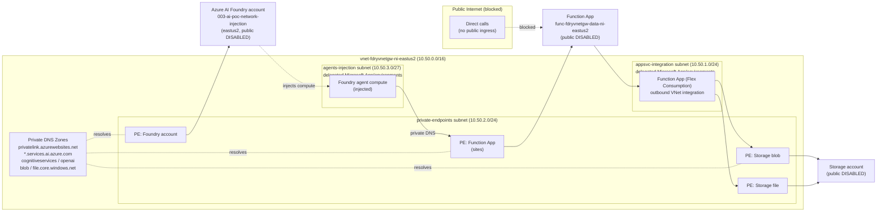
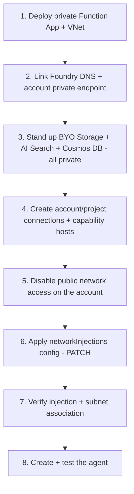
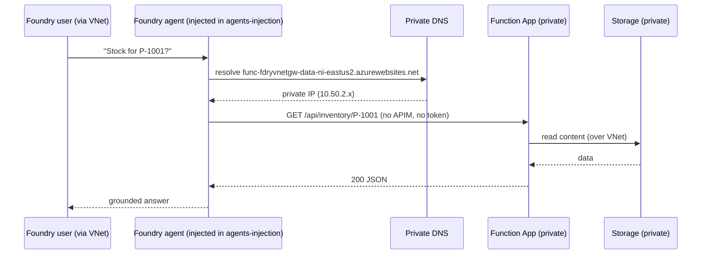

# Private Function App as a Foundry Agent Tool — via Virtual Network Injection

This guide shows how to provision a **private Azure Function App** that serves data APIs and
consume it as an **OpenAPI tool** in an **Azure AI Foundry agent** — with **no APIM gateway**,
**no token exchange**, and **public network access disabled** end to end.

It is the **network-injection** counterpart to the [APIM-gateway edition](../function-app/README.md).
Instead of routing the agent → private APIM → private Function App, the Foundry account uses
**virtual network injection**: the agent's compute is injected into a delegated subnet of *your*
VNet, so it resolves the Function App's **private endpoint** through private DNS and calls it
**directly**. The private network boundary is the only access control.

Everything is **config-driven**. No resource names, URLs, subnets, or paths are hardcoded in the
scripts or function code; they all come from
[`config/network_injection_config.json`](config/network_injection_config.json).

---

## Table of Contents

- [How This Differs from the APIM Edition](#how-this-differs-from-the-apim-edition)
- [Architecture](#architecture)
- [Key Resources & URLs](#key-resources--urls)
- [Why Each Resource Is Private](#why-each-resource-is-private)
- [Prerequisites](#prerequisites)
- [Configuration (No Hardcoding)](#configuration-no-hardcoding)
- [The Function App](#the-function-app)
- [API Endpoints](#api-endpoints)
- [Step-by-Step: Private Function App + Foundry Network Injection](#step-by-step-private-function-app--foundry-network-injection)
  - [Step 1 — Provision the private Function App + eastus2 VNet](#step-1--provision-the-private-function-app--eastus2-vnet)
  - [Step 2 — Verify private networking](#step-2--verify-private-networking)
  - [Step 3 — Configure Foundry virtual network injection](#step-3--configure-foundry-virtual-network-injection)
  - [Step 4 — Give your machine access to the private Foundry portal](#step-4--give-your-machine-access-to-the-private-foundry-portal)
  - [Step 5 — Create the agent (direct, no APIM)](#step-5--create-the-agent-direct-no-apim)
  - [Step 6 — Test the agent](#step-6--test-the-agent)
- [Standard Agent Setup Prerequisite (Read Before Step 3)](#standard-agent-setup-prerequisite-read-before-step-3)
- [Deployment Steps — Network Injection Setup & Config](#deployment-steps--network-injection-setup--config)
- [Network Flow Summary](#network-flow-summary)
- [Deployment Workflow (CI)](#deployment-workflow-ci)
- [Configuration Reference](#configuration-reference)
- [Troubleshooting](#troubleshooting)
- [Microsoft Learn References](#microsoft-learn-references)

---

## How This Differs from the APIM Edition

| Aspect | APIM edition ([`function-app/`](../function-app/README.md)) | Network-injection edition (this folder) |
|--------|-----------------------------------------------------------|-----------------------------------------|
| Agent → backend path | Agent → private **APIM** → private Function App | Agent (in your VNet) → **directly** to private Function App |
| Where the agent runs | Foundry-managed network, reaches APIM via its private endpoint | **Injected into your VNet** (`Microsoft.App/environments` subnet) |
| Gateway | APIM StandardV2 (private) in front | **None** |
| Tool auth | Managed-identity token validated by APIM (`validate-azure-ad-token`) | **Anonymous** — the private network boundary is the control |
| Foundry account | `002-ai-poc-private` (eastus) | `003-ai-poc-network-injection` (**eastus2**) |
| Public access | Disabled on Function, APIM, Foundry | Disabled on Function and Foundry (no APIM) |
| Extra requirement | APIM outbound VNet integration | **Standard Agent setup** (BYO Storage + Search + Cosmos DB) + agent subnet |

Network injection removes two whole hops (APIM + the token dance) at the cost of requiring the
Foundry **Standard Agent setup** so the platform can inject agent compute into your subnet.

---

## Architecture



**Request path:** Foundry agent (running in `agents-injection`) → (private DNS) →
**Function App private endpoint** → Function runtime → (VNet integration) → **private Storage**.
No hop traverses the public internet, and there is no APIM gateway in the path.

---

## Key Resources & URLs

| Resource | Name / URL | Reachable from |
|----------|------------|----------------|
| Foundry account | `003-ai-poc-network-injection` (eastus2) | Private endpoint only |
| Foundry project endpoint | `https://003-ai-poc-network-injection.services.ai.azure.com/api/projects/proj-default` | Inside the VNet only |
| Foundry portal | `https://ai.azure.com` | Browser via a VNet path (see [Step 4](#step-4--give-your-machine-access-to-the-private-foundry-portal)) |
| Function host | `https://func-fdryvnetgw-data-ni-eastus2.azurewebsites.net` | Inside the VNet only |
| Function API base | `https://func-fdryvnetgw-data-ni-eastus2.azurewebsites.net/api` | Inside the VNet only |
| Function Swagger UI | `https://func-fdryvnetgw-data-ni-eastus2.azurewebsites.net/api/swagger` | Inside the VNet only |
| Injected VNet | `vnet-fdryvnetgw-ni-eastus2` (10.50.0.0/16) | — |
| Agent subnet | `agents-injection` (10.50.3.0/27, delegated `Microsoft.App/environments`) | — |

> All values are derived from [`config/network_injection_config.json`](config/network_injection_config.json).
> Change a name there and the scripts and these URLs change with it.

---

## Why Each Resource Is Private

| Hop | Mechanism | Public access |
|-----|-----------|---------------|
| Agent → Function | Agent injected into `agents-injection`; Function private endpoint (`privatelink.azurewebsites.net`) | Function `publicNetworkAccess=Disabled` (no selected networks) |
| Function → Storage | Function regional VNet integration + Storage blob/file private endpoints | Storage `publicNetworkAccess=Disabled`, default `Deny` |
| Foundry control/data plane | Foundry account private endpoint (`*.services.ai.azure.com` + cognitiveservices + openai) | Foundry `publicNetworkAccess=Disabled` |
| Name resolution | Private DNS zones linked to `vnet-fdryvnetgw-ni-eastus2` | Split-horizon: public DNS never returns private IPs |

---

## Prerequisites

- Azure CLI logged in to subscription `86b37969-9445-49cf-b03f-d8866235171c`.
- Python 3.11 and (optionally) [Azure Functions Core Tools v4](https://learn.microsoft.com/azure/azure-functions/functions-run-local) for local testing.
- The private Foundry account `003-ai-poc-network-injection` (eastus2, `publicNetworkAccess=Disabled`) already created — it is in this environment.
- **Owner** (or `Microsoft.Authorization/roleAssignments/write`) on the subscription, required to configure the Standard Agent setup and network injection.
- For network injection specifically: the **Standard Agent setup** prerequisites described in
  [Standard Agent Setup Prerequisite](#standard-agent-setup-prerequisite-read-before-step-3).

---

## Configuration (No Hardcoding)

All settings live in [`config/network_injection_config.json`](config/network_injection_config.json):

| Section | Purpose |
|---------|---------|
| `function_app` | App name, runtime, routes, public access |
| `hosting_plan` | Plan name/SKU (eastus2 to match the account) |
| `storage_account` | Name, SKU, private storage, blob/file DNS zones |
| `networking` | New eastus2 VNet, the 3 subnets (PE, integration, **agents-injection /27**), DNS zones |
| `foundry` | Account, project endpoint, `network_injection` (scenario/subnet) |
| `portal_access` | Developer IPs + jump-box subnet for portal access |
| `foundry_agent` | Agent name, model, tool name, **anonymous** auth, instructions |
| `endpoints` | Deterministic URLs echoed by the scripts |

---

## The Function App

- **Model:** Azure Functions **Python v2** ([`function-app/function_app.py`](function-app/function_app.py)) — an exact clone of the APIM edition's data APIs.
- **Hosting:** Linux, Functions runtime v4, **Flex Consumption** plan (FC1) in **eastus2** — serverless, supports regional VNet integration + private endpoints, and needs **no dedicated App Service VM quota** (dedicated B1/Premium quota is 0 in this subscription/region).
- **Storage auth (no keys):** the storage account has **shared-key access disabled** by Azure Policy, so the app uses a **user-assigned managed identity** (`id-func-fdryvnetgw-ni`) for both the runtime (`AzureWebJobsStorage__*` identity settings) and the **deployment** container (`--deployment-storage-auth-type UserAssignedIdentity`). No account keys exist anywhere in the app config.
- **Data:** read-only sample catalog in [`function-app/data/catalog.json`](function-app/data/catalog.json) (products, categories, inventory, orders).
- **Auth:** anonymous at the function layer — access is enforced by the **private network boundary**.

```
FN-App-Foundry-Network-Injection/
├── README.md                                   # this file
├── config/
│   └── network_injection_config.json           # single source of truth
├── function-app/
│   ├── function_app.py                         # v2 model: all HTTP routes
│   ├── host.json                               # routePrefix "api", extension bundle v4
│   ├── requirements.txt                        # azure-functions
│   ├── openapi.json                            # OpenAPI 3.0 spec (server = private host)
│   ├── data/catalog.json                       # sample data
│   └── .funcignore
└── scripts/
    ├── deploy-ni-function-app.ps1              # VNet + subnets + private Function App
    ├── configure-standard-agent-setup.ps1      # BYO Storage+Search+Cosmos + connections + caphosts
    ├── configure-foundry-network-injection.ps1 # DNS + Foundry PE + networkInjections PATCH
    ├── enable-portal-access.ps1                # JumpBox | IpAllow | Revert
    └── create_ni_function_agent.py             # Foundry agent OpenAPI tool (direct, anonymous)
```

---

## API Endpoints

| Method | Route | Description |
|--------|-------|-------------|
| GET | `/api/health` | Liveness/readiness probe |
| GET | `/api/products?category={id}` | List products (optional category filter) |
| GET | `/api/products/{productId}` | Get a product by id |
| GET | `/api/categories` | List categories with product counts |
| GET | `/api/inventory/{productId}` | Stock levels per warehouse |
| GET | `/api/orders?status={status}` | List orders (optional status filter) |
| GET | `/api/openapi.json` | OpenAPI 3.0 document (server URL resolved to caller host) |
| GET | `/api/swagger` | Swagger UI |

---

## Step-by-Step: Private Function App + Foundry Network Injection

### Step 1 — Provision the private Function App + eastus2 VNet

```powershell
./scripts/deploy-ni-function-app.ps1
```

Idempotent stages: **VNet + subnets** (private-endpoints, appsvc-integration delegated
`Microsoft.App/environments`, **agents-injection /27**) → storage (shared-key disabled) →
**user-assigned managed identity** + storage role grants (Blob Data Owner, Queue/Table Data
Contributor) → **Flex Consumption** Function App (VNet-integrated, identity-based runtime +
deployment storage) → code deploy (while SCM is still reachable) → private endpoints (storage
blob/file/queue/table + Function `sites`) → **disable public network access** on storage and the
Function App (no selected networks).

Options: `-SkipDeploy` (infra only) · `-KeepPublicAccess` (skip the final lockdown for debugging).

### Step 2 — Verify private networking

```powershell
# Function App public access should be Disabled
az functionapp show -g ai-myaacoub -n func-fdryvnetgw-data-ni-eastus2 --query publicNetworkAccess -o tsv

# The agent subnet must show the Microsoft.App/environments delegation
az network vnet subnet show -g ai-myaacoub --vnet-name vnet-fdryvnetgw-ni-eastus2 -n agents-injection `
  --query "delegations[].serviceName" -o tsv

# Private endpoint A record exists
az network private-dns record-set a list -g ai-myaacoub -z privatelink.azurewebsites.net -o table
```

A direct public call to the function host should fail; it is reachable only inside the VNet.

### Step 3 — Configure Foundry virtual network injection

> ⚠️ **Read [Standard Agent Setup Prerequisite](#standard-agent-setup-prerequisite-read-before-step-3) first.**
> Network injection is only accepted on a **Standard Agent** account (BYO Storage + Search +
> Cosmos DB, all private, plus capability hosts). The script below reports clearly and stops if
> those are missing — it never leaves partial state.

```powershell
./scripts/configure-foundry-network-injection.ps1
```

Idempotent stages: Foundry private DNS zones linked to the new VNet → Foundry account **private
endpoint** into the new VNet → **PATCH** `properties.networkInjections` to point the `agent`
scenario at the `agents-injection` subnet (`useMicrosoftManagedNetwork=false`).

Preview the PATCH without applying it:

```powershell
./scripts/configure-foundry-network-injection.ps1 -WhatIfInjection
```

The applied shape (per the [NetworkInjection API](https://learn.microsoft.com/python/api/azure-mgmt-cognitiveservices/azure.mgmt.cognitiveservices.models.networkinjection)) is:

```json
{
  "properties": {
    "networkInjections": [
      {
        "scenario": "agent",
        "subnetArmId": ".../virtualNetworks/vnet-fdryvnetgw-ni-eastus2/subnets/agents-injection",
        "useMicrosoftManagedNetwork": false
      }
    ]
  }
}
```

### Step 4 — Give your machine access to the private Foundry portal

The account is `publicNetworkAccess=Disabled`, so the portal data-plane only works from a host
that resolves the Foundry **private endpoint**. There is no literal "add my IP to the VNet" — a
laptop joins the network or is temporarily allowlisted. The script supports both:

**Pattern A — private path (recommended, stays fully private):**

```powershell
./scripts/enable-portal-access.ps1 -Mode JumpBox
```

Creates a `dev-jumpbox` subnet and prints the steps to reach `https://ai.azure.com` from inside
the VNet (Azure Bastion jump box / Point-to-Site VPN / `az network bastion tunnel`). Nothing is
exposed publicly.

**Pattern B — temporary IP allowlist (testing convenience, weaker):**

```powershell
# Flip account to Enabled + default-Deny + allow your IP(s) from config.portal_access.developer_ips
./scripts/enable-portal-access.ps1 -Mode IpAllow
# ... test from the browser ...
./scripts/enable-portal-access.ps1 -Mode Revert   # return to fully private
```

> **SNAT caveat:** this client's egress to Azure PaaS often rotates through a pool of Azure SNAT
> IPs (not the office internet IP), and the nextgen portal proxies a backend probe from a
> Microsoft IP. A single `/32` rule can be insufficient — prefer Pattern A.

### Step 5 — Create the agent (direct, no APIM)

**Prerequisite — a chat model deployment.** The agent needs a model deployment on the account.
If the project has none, agent runs fail with `invalid_engine_error: Failed to resolve model info`.
Deploy the model named in `foundry_agent.model_deployment` (default `gpt-4.1`) once:

```powershell
# Lists available gpt-4* models; -Deploy creates the gpt-4.1 deployment (Standard, capacity 50)
./scripts/ensure-ni-model-deployment.ps1            # list only
./scripts/ensure-ni-model-deployment.ps1 -Deploy    # create gpt-4.1
```

> A freshly created deployment can take a few minutes to propagate; a transient
> `invalid_deployment: The API deployment for this resource does not exist` right after creation
> clears on retry.

Then run from a host that can reach the private project endpoint (inside the VNet, or while the
account is IP-allowed from Step 4):

```powershell
python ./scripts/create_ni_function_agent.py
```

Creates/updates `Data-Function-Agent` on `proj-default` with an **OpenAPI tool** named
`data_function_api` whose server URL is the **private Function App host root**
`https://func-fdryvnetgw-data-ni-eastus2.azurewebsites.net`. The OpenAPI spec's paths already
include the `/api` route prefix, so the server URL is the bare host (not `.../api`); otherwise
calls double up to `/api/api/...` and 404. Auth is **anonymous** — the injected agent reaches the
function over its private endpoint, so no APIM token is needed.

### Step 6 — Test the agent

**Scripted (end-to-end):** invoke the agent and print its answer. The agent must call the
`data_function_api` tool, which can only succeed over the private path:

```powershell
python ./scripts/test_ni_function_agent.py
python ./scripts/test_ni_function_agent.py "List the product categories."
```

**Portal:** open [https://ai.azure.com](https://ai.azure.com) (via your VNet path from Step 4), select
project `proj-default`, open `Data-Function-Agent`, and ask:

- *"List all products in the audio category."*
- *"How much stock is available for P-1001?"*
- *"Show me all shipped orders."*

The agent invokes `data_function_api` → (private DNS) → private Function App → returns grounded data.

> **Tool egress goes through the data proxy in your subnet — private DNS must resolve the
> function name to its private IP.** Per the Microsoft traffic-flow table, OpenAPI tool and Azure
> Functions tool calls route *through your VNet subnet* via the single-tenant **data proxy** in
> the delegated subnet, reaching the function's **private endpoint**. This requires
> `privatelink.azurewebsites.net` to be linked to the injected VNet with an A record for the
> function (Step 2 / the deploy script set this up). If the data proxy resolves the function to
> its **public** IP, the call egresses to the public front door and returns
> `HTTP 403 Ip Forbidden` once public access is disabled — see
> [Troubleshooting](#troubleshooting).

#### Re-locking the Function App after an out-of-band recreate

Recreating the Flex app (for example, to fix storage auth) **drops its private endpoint**. To
restore the private endpoint + DNS and disable public access **without** touching the (working)
storage account, re-run the deploy script with both switches and then verify:

```powershell
# Re-applies ONLY the function PE + privatelink.azurewebsites.net link + public-access lockdown.
# -SkipDeploy skips the code push; -SkipStorageLockdown leaves storage endpoints/access untouched.
powershell -NoProfile -ExecutionPolicy Bypass -File ./scripts/deploy-ni-function-app.ps1 -SkipDeploy -SkipStorageLockdown

# Confirms: publicNetworkAccess=Disabled, PE Approved, zone linked, A record -> private IP
powershell -NoProfile -ExecutionPolicy Bypass -File ./scripts/verify-ni-func-private.ps1
```

---

## Standard Agent Setup Prerequisite (Read Before Step 3)

Foundry **virtual network injection** is part of the **Standard Agent setup with private
networking**. The platform only injects agent compute into your subnet when the account brings
its own dependencies and is fully private. Specifically:

1. **Bring-your-own resources (all private):** an Azure **Storage** account, an **Azure AI
   Search** service, and an **Azure Cosmos DB** account — each with `publicNetworkAccess=Disabled`
   and its own private endpoint in the VNet. Managed (Basic) resources are **not** supported with
   injection.
2. **Capability hosts** on the account and the project that reference those connections.
3. **Public network access Disabled** on the Foundry account.
4. An **agent subnet** delegated to `Microsoft.App/environments`, **/27 or larger** (this folder
   provisions `agents-injection` 10.50.3.0/27 in Step 1).

The current account `003-ai-poc-network-injection` has the Standard Agent setup **fully applied** by
[`scripts/configure-standard-agent-setup.ps1`](scripts/configure-standard-agent-setup.ps1): dedicated
**cost-effective** BYO resources (Cosmos DB **serverless**, Azure AI Search **basic**, Standard_LRS
storage), project connections, the required role assignments, and **account + project capability
hosts** (both `Succeeded`). The `networkInjections` PATCH in Step 3 therefore succeeds. To reproduce
from scratch, run that script (it is idempotent), then re-run Step 3. The equivalent Microsoft
samples are:

- **Bicep:** [`15-private-network-standard-agent-setup`](https://github.com/microsoft-foundry/foundry-samples/tree/main/infrastructure/infrastructure-setup-bicep/15-private-network-standard-agent-setup)
- **Terraform (BYO VNet):** [`15b-private-network-standard-agent-setup-byovnet`](https://github.com/microsoft-foundry/foundry-samples/tree/main/infrastructure/infrastructure-setup-terraform/15b-private-network-standard-agent-setup-byovnet)
- Concepts: [Deep dive into Foundry Agent Service networking](https://learn.microsoft.com/azure/foundry/agents/concepts/agents-networking-deep-dive)

The script points all resources at `vnet-fdryvnetgw-ni-eastus2` and the `agents-injection` subnet
created here so everything shares one VNet.

---

## Deployment Steps — Network Injection Setup & Config

End-to-end, ordered steps to take the bare private account `003-ai-poc-network-injection` to a
working **virtual-network-injected** agent. Steps 1–2 are fully automated by the scripts in this
folder; steps 3–5 stand up the **Standard Agent** dependencies that injection requires; step 6
applies the injection **config**; steps 7–8 verify and create the agent. Every value comes from
[`config/network_injection_config.json`](config/network_injection_config.json).



### 0. Prerequisites

- Azure CLI signed in to subscription `86b37969-9445-49cf-b03f-d8866235171c`, with **Owner** (or
  `Microsoft.Authorization/roleAssignments/write`) so the setup can create role assignments,
  capability hosts, and the injection config.
- `python` 3.11 available for the agent script.

### 1. Deploy the private Function App + injected VNet *(automated)*

```powershell
./scripts/deploy-ni-function-app.ps1
```

Creates `vnet-fdryvnetgw-ni-eastus2` and the **three** subnets (`private-endpoints`,
`appsvc-integration` delegated `Microsoft.App/environments`, and the **`agents-injection` /27**
that injection binds to), the **user-assigned managed identity** + storage role grants, the
**Flex Consumption** Function App (identity-based storage), private endpoints, and the public-access
lockdown. This is the network the agent compute will be injected into.

### 2. Link Foundry private DNS + create the account private endpoint *(automated)*

```powershell
./scripts/configure-foundry-network-injection.ps1
```

Stages 1–2 run on a bare account: they link the Foundry private DNS zones
(`privatelink.services.ai.azure.com`, `…cognitiveservices…`, `…openai…`) to
`vnet-fdryvnetgw-ni-eastus2` and create the **account private endpoint** (`groupId=account`) with a
DNS zone group. Stage 3 (the injection PATCH) is attempted and will **report that the Standard
Agent setup is missing** — that is expected until step 6.

### 3. Stand up the Standard Agent BYO dependencies *(automated)*

Injection is only accepted on a **Standard Agent** account that brings its own **Storage**, **AI
Search**, and **Cosmos DB**. Provision them — plus the project connections, role assignments, and
the account/project **capability hosts** — with the single config-driven script:

```powershell
./scripts/configure-standard-agent-setup.ps1
```

Idempotent stages: create the three **cost-effective** BYO resources (Cosmos **serverless**, Search
**basic**, Standard_LRS storage) → create the three project **connections** (AAD, no keys) → grant
the project managed identity the **pre-capability-host** roles → create the **account** capability
host (empty `Agents`) then the **project** capability host (referencing the connections), polling
until both report **Succeeded** → grant the **post-capability-host** data-plane roles. Add
`-Lockdown` to also add private endpoints + disable public access on the BYO resources once the
end-to-end path is verified (off by default to avoid per-endpoint cost).

> **Region note:** Azure AI Search basic/standard capacity was exhausted in eastus2
> (`InsufficientResourcesAvailable`) and the subscription's free-tier slot was already used, so the
> BYO search is created in the adjacent **eastus** region. Standard Agent permits cross-region BYO
> resources; this is captured in `standard_agent.search.location`.

### 4. Verify the connections + capability hosts *(automated by step 3)*

Step 3 wires the three BYO resources to the project as **connections** and creates **capability
hosts** on both the account and the project. Confirm they exist:

```powershell
# Account-level capability host(s)
az rest --method get --url ("https://management.azure.com/subscriptions/86b37969-9445-49cf-b03f-d8866235171c/resourceGroups/ai-myaacoub/providers/Microsoft.CognitiveServices/accounts/003-ai-poc-network-injection/capabilityHosts?api-version=2025-04-01-preview")

# Project-level capability host(s)
az rest --method get --url ("https://management.azure.com/subscriptions/86b37969-9445-49cf-b03f-d8866235171c/resourceGroups/ai-myaacoub/providers/Microsoft.CognitiveServices/accounts/003-ai-poc-network-injection/projects/proj-default/capabilityHosts?api-version=2025-04-01-preview")
```

Both must return at least one capability host before injection is accepted.

### 5. Disable public network access on the account

If the setup temporarily re-enabled public access, return the account to fully private:

```powershell
$acctId = "/subscriptions/86b37969-9445-49cf-b03f-d8866235171c/resourceGroups/ai-myaacoub/providers/Microsoft.CognitiveServices/accounts/003-ai-poc-network-injection"
$body = '{"properties":{"publicNetworkAccess":"Disabled"}}'
[System.IO.File]::WriteAllText("$env:TEMP\acct.json", $body, (New-Object System.Text.UTF8Encoding($false)))
az rest --method patch --url ("https://management.azure.com" + $acctId + "?api-version=2025-04-01-preview") `
  --headers "Content-Type=application/json" --body "@$env:TEMP\acct.json" --output-file "$env:TEMP\acct-out.json"
```

### 6. Apply the network injection (config)

With the Standard Agent setup in place, re-run the configure script — its Stage 3 PATCH now succeeds:

```powershell
# Preview the exact PATCH body first
./scripts/configure-foundry-network-injection.ps1 -WhatIfInjection

# Apply it
./scripts/configure-foundry-network-injection.ps1
```

Or apply the injection config directly. The body points the **`agent`** scenario at the
**`agents-injection`** subnet and opts out of the Microsoft-managed network:

```powershell
$acctId = "/subscriptions/86b37969-9445-49cf-b03f-d8866235171c/resourceGroups/ai-myaacoub/providers/Microsoft.CognitiveServices/accounts/003-ai-poc-network-injection"
$subnet = "/subscriptions/86b37969-9445-49cf-b03f-d8866235171c/resourceGroups/ai-myaacoub/providers/Microsoft.Network/virtualNetworks/vnet-fdryvnetgw-ni-eastus2/subnets/agents-injection"
$body = (@{ properties = @{ networkInjections = @(@{ scenario = "agent"; subnetArmId = $subnet; useMicrosoftManagedNetwork = $false }) } } | ConvertTo-Json -Depth 6)
[System.IO.File]::WriteAllText("$env:TEMP\inj.json", $body, (New-Object System.Text.UTF8Encoding($false)))
az rest --method patch --url ("https://management.azure.com" + $acctId + "?api-version=2025-04-01-preview") `
  --headers "Content-Type=application/json" --body "@$env:TEMP\inj.json" --output-file "$env:TEMP\inj-out.json"
```

> Write the `--body` file **BOM-free** (as above) and route the response to `--output-file` — on
> Windows, `az rest` otherwise crashes printing the BOM/response to the cp1252 console.

### 7. Verify the injection + subnet association

```powershell
# networkInjections is now populated on the account
az rest --method get --url ("https://management.azure.com" + $acctId + "?api-version=2025-04-01-preview") `
  --query "properties.networkInjections" -o json

# The agent subnet carries the Microsoft.App/environments delegation (and, once injected,
# a serviceAssociationLink for the agent environment)
az network vnet subnet show -g ai-myaacoub --vnet-name vnet-fdryvnetgw-ni-eastus2 -n agents-injection `
  --query "{delegations:delegations[].serviceName, links:serviceAssociationLinks[].linkedResourceType}" -o json
```

### 8. Create + test the agent

```powershell
# From a VNet-connected host (or while the account is IP-allowed via Step 4 of the walkthrough above)
python ./scripts/create_ni_function_agent.py
```

Then open [https://ai.azure.com](https://ai.azure.com) over your VNet path, select `proj-default`,
open `Data-Function-Agent`, and ask *"List all products in the audio category."* The injected agent
resolves the Function App's private endpoint via private DNS and calls
`https://func-fdryvnetgw-data-ni-eastus2.azurewebsites.net/api` **directly** — no APIM, no token.

> **Current environment status:** the full path is **deployed and live**. Steps 1–2 (VNet, three
> subnets, Flex Function App with all eight functions, `/api/health` → 200, Foundry DNS + account
> private endpoint), step 3 (BYO Cosmos `cosmos-fdryvnetgw-ni` *serverless*, Search
> `srch-fdryvnetgw-ni` *basic, eastus*, Storage `stfdryniagent`; connections; RBAC; **account +
> project capability hosts = Succeeded**), and step 6 (the `networkInjections` PATCH —
> `agent` → `agents-injection`, `useMicrosoftManagedNetwork=false`) are all applied. Remaining:
> step 4 portal access for your machine and step 8 agent creation from a VNet-connected host, plus
> optional `-Lockdown` to privatize the BYO resources.

---

## Network Flow Summary



---

## Deployment Workflow (CI)

[`.github/workflows/deploy-ni-function-app.yml`](../.github/workflows/deploy-ni-function-app.yml)
provisions the infra on `workflow_dispatch` or when this folder's function code / config / deploy
script changes (markdown excluded). Steps: checkout → read config → setup-python → `azure/login`
(OIDC) → `deploy-ni-function-app.ps1` → `configure-foundry-network-injection.ps1`
(`continue-on-error` until the Standard Agent setup exists).

> **CI limitation (same as the APIM edition):** once the Function App is
> `publicNetworkAccess=Disabled`, its SCM/Kudu endpoint is private and a **public** GitHub runner
> cannot push code. The deploy script detects this and skips the code push (infra stages remain
> idempotent). Push code from a **self-hosted runner inside the VNet**, or temporarily re-enable
> public access, deploy, and re-disable. `create_ni_function_agent.py` likewise needs a
> VNet-connected host.

Required repo secrets: `AZURE_CLIENT_ID`, `AZURE_TENANT_ID`, `AZURE_SUBSCRIPTION_ID` (federated
credential / OIDC).

---

## Configuration Reference

| File | Role |
|------|------|
| [`config/network_injection_config.json`](config/network_injection_config.json) | Single source of truth for this feature |
| [`scripts/deploy-ni-function-app.ps1`](scripts/deploy-ni-function-app.ps1) | eastus2 VNet + subnets + private Function App |
| [`scripts/configure-standard-agent-setup.ps1`](scripts/configure-standard-agent-setup.ps1) | BYO Storage/Search/Cosmos + connections + RBAC + capability hosts |
| [`scripts/configure-foundry-network-injection.ps1`](scripts/configure-foundry-network-injection.ps1) | Foundry DNS + private endpoint + `networkInjections` PATCH |
| [`scripts/enable-portal-access.ps1`](scripts/enable-portal-access.ps1) | Portal access: JumpBox / IpAllow / Revert |
| [`scripts/ensure-ni-model-deployment.ps1`](scripts/ensure-ni-model-deployment.ps1) | List gpt-4* models; deploy the agent's chat model (gpt-4.1) |
| [`scripts/verify-ni-func-private.ps1`](scripts/verify-ni-func-private.ps1) | Verify the Function App is private-only (public access, PE, DNS, A record) |
| [`scripts/recreate-ni-project-caphost.ps1`](scripts/recreate-ni-project-caphost.ps1) | Delete + recreate the project capability host to refresh the data proxy's private DNS view |
| [`scripts/create_ni_function_agent.py`](scripts/create_ni_function_agent.py) | Foundry agent OpenAPI tool (direct, anonymous) |
| [`scripts/test_ni_function_agent.py`](scripts/test_ni_function_agent.py) | Invoke the agent end-to-end and print the grounded answer |
| [`function-app/function_app.py`](function-app/function_app.py) | Function code (Python v2) |
| [`function-app/openapi.json`](function-app/openapi.json) | OpenAPI 3.0 spec |

---

## Troubleshooting

| Symptom | Likely cause | Fix |
|---------|--------------|-----|
| `networkInjections` PATCH returns 400/`InvalidRequest` | Account is not a Standard Agent setup (no BYO Storage/Search/Cosmos + capability hosts) | Complete the [Standard Agent Setup](#standard-agent-setup-prerequisite-read-before-step-3), then re-run Step 3 |
| PATCH rejected: subnet not delegated / too small | Agent subnet missing `Microsoft.App/environments` or smaller than /27 | Re-run Step 1; confirm `agents-injection` is /27+ and delegated |
| `az search service create` fails `InsufficientResourcesAvailable` | Search SKU capacity exhausted in the region | Create the BYO search in an adjacent region (the script honors `standard_agent.search.location`, here `eastus`) — cross-region BYO is allowed |
| Capability host stuck `Failed` / `CapabilityHostProvisioningFailed` | Insufficient Cosmos RU/s, or caphost can't be updated | Use serverless or ≥3000 RU/s Cosmos; the setup script deletes+recreates a Failed caphost (they're immutable) |
| `functionapp create` fails: "storage has networking restrictions" | Storage locked before the app could reach it | The deploy script sets VNet integration at create time; ensure file PE + `privatelink.file` zone exist (Step 1 handles this) |
| Function returns 500 on cold start | Private storage locked down before content share ready | Re-run deploy with `-KeepPublicAccess`, confirm start, then lock down |
| Agent tool call times out | Agent can't resolve/reach the Function privately | Confirm injection is applied, `agents-injection` delegation, and `privatelink.azurewebsites.net` A record |
| Agent run fails `invalid_engine_error: Failed to resolve model info` | No model deployment on the project | Run `scripts/ensure-ni-model-deployment.ps1 -Deploy` to deploy `gpt-4.1` |
| Agent run fails `invalid_deployment: The API deployment ... does not exist` | Model deployment created < ~5 min ago | Wait briefly and re-run the test; the deployment is still propagating |
| Tool URL hits `/api/api/...` (404) | Tool server URL set to `.../api` while spec paths already include `/api` | Use the host root as the server URL (`create_ni_function_agent.py` now does this) |
| Agent tool call returns `HTTP 403 Ip Forbidden` (HTML "Web App - Unavailable", header `x-ms-forbidden-ip: <rotating public IP>`) after public access is disabled | The data proxy resolved the function to its **public** IP and egressed to the public front door instead of the private endpoint | This requires VNet-side validation, not more config changes. 1) Confirm config is correct with `verify-ni-func-private.ps1` — the VNet must use **Azure default DNS** (no custom DNS servers, which would bypass private zones), `privatelink.azurewebsites.net` must be **linked** to the injected VNet, and an A record must point the function to its private IP. 2) Per the docs' [*Verify the deployment*](https://learn.microsoft.com/azure/ai-foundry/agents/how-to/virtual-networks) steps 3–4, validate from a **VNet-joined host**: `nslookup func-...azurewebsites.net` must return the private IP, then run the agent **with the Foundry account fully private** (`enable-portal-access.ps1 -Mode Revert`). The Standard Setup's "no public egress" guarantee applies to the fully-private posture; testing while the account is temporarily IP-allowed for internet access is not representative. 3) If the function PE/DNS were created **after** the capability host, recreate the project capability host (`recreate-ni-project-caphost.ps1`) so the data proxy re-reads current private DNS. 4) If it still egresses publicly after all of the above, open a **Microsoft support** ticket — the data proxy is not honoring the linked private zone |
| Foundry portal shows a network/access error | Your machine isn't on a VNet path and isn't allowlisted | Use [Step 4](#step-4--give-your-machine-access-to-the-private-foundry-portal): Pattern A (JumpBox) or Pattern B (IpAllow) |
| Portal still blocked after IpAllow | Egress IP rotates (Azure SNAT) or portal backend probe denied | Prefer Pattern A (JumpBox); IP allowlisting can't cover rotating/backend IPs |
| Zip deploy fails after lockdown | SCM site is private | Deploy code before disabling public access, or from a VNet host |
| `create_ni_function_agent.py` cannot connect | Run from the public internet against a private account | Run from inside the VNet, or while the account is IP-allowed (Step 4) |

---

## Microsoft Learn References

- [Set up private networking for Foundry Agent Service](https://learn.microsoft.com/azure/foundry/agents/how-to/virtual-networks)
- [Deep dive into Foundry Agent Service networking](https://learn.microsoft.com/azure/foundry/agents/concepts/agents-networking-deep-dive)
- [How to configure network isolation for Microsoft Foundry](https://learn.microsoft.com/azure/foundry/how-to/configure-private-link)
- [Foundry Agent Service environment setup (Basic vs Standard)](https://learn.microsoft.com/azure/foundry/agents/environment-setup)
- [NetworkInjection model (azure-mgmt-cognitiveservices)](https://learn.microsoft.com/python/api/azure-mgmt-cognitiveservices/azure.mgmt.cognitiveservices.models.networkinjection)
- [Standard Agent setup samples (Bicep / Terraform)](https://github.com/microsoft-foundry/foundry-samples/tree/main/infrastructure)
- [Azure Functions networking options](https://learn.microsoft.com/azure/azure-functions/functions-networking-options)
- [Use private endpoints for Azure Functions / App Service](https://learn.microsoft.com/azure/app-service/networking/private-endpoint)
- [Integrate your app with an Azure virtual network (regional VNet integration)](https://learn.microsoft.com/azure/app-service/overview-vnet-integration)
- [Restrict storage to a virtual network for Azure Functions](https://learn.microsoft.com/azure/azure-functions/configure-networking-how-to#restrict-your-storage-account-to-a-virtual-network)
- [Azure Functions Python developer guide (v2 model)](https://learn.microsoft.com/azure/azure-functions/functions-reference-python)
- [How to use Azure AI Foundry Agent Service with OpenAPI Specified Tools](https://learn.microsoft.com/azure/ai-foundry/agents/how-to/tools/openapi-spec)
- [Azure Private DNS zones for private endpoints](https://learn.microsoft.com/azure/private-link/private-endpoint-dns)
- [Azure Bastion overview](https://learn.microsoft.com/azure/bastion/bastion-overview)
