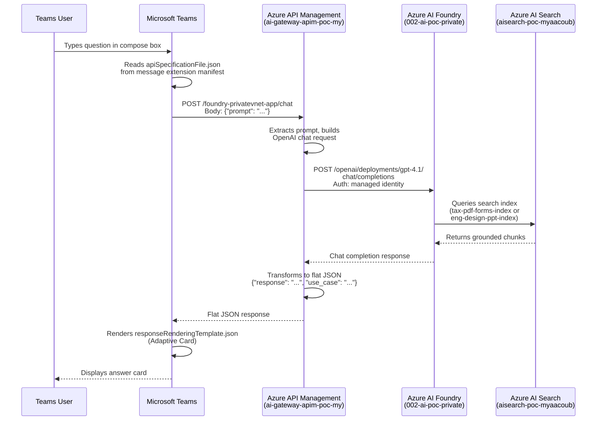

# Foundry Private VNET APIM Gateway

This repository implements a private Azure AI Foundry deployment where Azure API Management is the AI Gateway and the primary control plane for client-to-agent traffic. The solution uses Terraform for infrastructure, a FastAPI backend behind APIM, and an adapted Ionic/Angular UI deployed with the API on a shared App Service Plan.

## Focus

The main design goal is to place APIM in front of Foundry so gateway concerns are handled centrally:

- expose a single client-facing API surface for the web app and Teams packages
- keep Foundry and Azure AI Search behind private networking and private DNS
- apply APIM import, routing, product, policy, and subscription controls in one place
- let the backend call APIM-managed routes instead of calling Foundry directly


## Live URLs

| Service | URL |
|---------|-----|
| UI | https://foundry-privatevnet-ui.azurewebsites.net |
| API | https://foundry-privatevnet-api.azurewebsites.net/api |
| API Health | https://foundry-privatevnet-api.azurewebsites.net/api/health |
| APIM Gateway | https://ai-gateway-apim-poc-my.azure-api.net |
| APIM API Surface | https://ai-gateway-apim-poc-my.azure-api.net/foundry-privatevnet-app/api |
| Foundry OpenAI Gateway | https://ai-gateway-apim-poc-my.azure-api.net/002-ai-poc-private/openai |

## Solution Overview

The deployed topology is:

- Azure AI Foundry project with private endpoint access
- Azure AI Search with private endpoint access
- Azure API Management as the public gateway and policy boundary
- one Linux App Service Plan hosting the UI App Service and API App Service
- VNet integration for the apps through a delegated subnet
- Log Analytics and diagnostic settings for the web apps

## Included Assets

- Terraform for VNet, subnets, private endpoints, private DNS, shared App Service Plan, App Services, identities, and diagnostics
- APIM import spec in [openapi/foundry-privatevnet-app.openapi.json](openapi/foundry-privatevnet-app.openapi.json)
- PowerShell automation for deployment, APIM configuration, source-driven private Search and agent provisioning, Teams packaging, and prompt smoke tests
- Teams packages for the two retained agents
- best-practices guidance in [docs/best-practices.md](docs/best-practices.md)

## Use Cases

The repo retains only the two Cosmos DB-backed use cases, and they are intentionally brief here because the repo focus is the APIM-to-Foundry gateway pattern rather than the business domain payloads.

- Tax PDF Forms: a Cosmos DB-backed corpus of PDF tax form content exposed through Azure AI Search and served by `Tax-PDF-Forms-Agent`
- Engineering Design PPT: a Cosmos DB-backed corpus of presentation content exposed through Azure AI Search and served by `Eng-Design-PPT-Agent`

The previous non-Cosmos use cases were removed from the active documentation surface.

## Deployment

Local prerequisites:

- Terraform 1.6+
- Azure CLI
- Docker
- Node.js 20+
- Python 3.11+

Main workflow:

```powershell
./scripts/deploy.ps1
```

That script runs Terraform validate plus a direct apply by default, then provisions the retained Search indexes and Foundry agents from the source-controlled definitions in `csdmichael/AI-Search-Blob-Storage`, configures the UI/API APIM surface, configures the Foundry OpenAI APIM gateway, generates Teams packages, and runs sample prompt tests.

App Service infrastructure is opt-in. Use `-DeployApi` and `-DeployUi` only when you want Terraform to manage the web apps and their shared App Service plan.

For faster iterative deployments, skip steps you are not changing:

```powershell
./scripts/deploy.ps1 -SkipTests -SkipPackage
```

To include App Service resources in a local deployment run:

```powershell
./scripts/deploy.ps1 -DeployApi -DeployUi
```

If you want the slower two-step Terraform flow with a saved plan file, use:

```powershell
./scripts/deploy.ps1 -DetailedPlan
```

## GitHub Actions Setup

The GitHub Actions deployment path is already wired for OpenID Connect with a user-assigned managed identity, so no client secret is required.

Provisioned Azure identity:

- identity name: `gha-foundry-privatevnet-oidc`
- client id: `b01a1a97-faef-4d58-8a9a-764d0b2697ec`
- tenant id: `b158173c-91f6-4f99-b5e9-aa9bcb463863`
- subscription id: `86b37969-9445-49cf-b03f-d8866235171c`

Federated credentials configured on that identity:

- `repo:csdmichael/FoundryPrivateVNET-APIM-Gateway:ref:refs/heads/main`

Azure RBAC granted to that identity:

- `Contributor` on resource group `ai-myaacoub`
- `Azure AI Developer` on `002-ai-poc-private`
- `Azure AI Developer` on `001-ai-poc`
- `Search Service Contributor` on `aisearch-poc-myaacoub`

Repository secrets configured in `csdmichael/FoundryPrivateVNET-APIM-Gateway`:

| Secret | Value |
|--------|-------|
| `AZURE_CLIENT_ID` | `b01a1a97-faef-4d58-8a9a-764d0b2697ec` |
| `AZURE_TENANT_ID` | `b158173c-91f6-4f99-b5e9-aa9bcb463863` |
| `AZURE_SUBSCRIPTION_ID` | `86b37969-9445-49cf-b03f-d8866235171c` |
| `API_WEBAPP_NAME` | `foundry-privatevnet-api` |
| `UI_WEBAPP_NAME` | `foundry-privatevnet-ui` |
| `APP_API_BASE_URL` | `https://ai-gateway-apim-poc-my.azure-api.net/foundry-privatevnet-app/api` |

GitHub environments are not required by the current workflow. The deployment runs as a single pipeline against one Terraform configuration and authenticates through the `main` branch OIDC subject.

When you run the `deploy` workflow manually from GitHub Actions, `deploy_api` and `deploy_ui` default to `false` and let you opt into either app deployment. Pushes to `main` run the infrastructure and post-deploy gateway/provisioning flow without redeploying the App Services.

Recommended operator flow:

1. Push to `main` or run the `deploy` workflow manually from GitHub Actions.
2. Let the `terraform` and `post-deploy` jobs finish before checking APIM and Foundry connectivity.
3. If you enabled app deployment, validate `https://foundry-privatevnet-api.azurewebsites.net/api/health`.
4. If you enabled app deployment, validate `https://foundry-privatevnet-ui.azurewebsites.net`.
5. Validate the APIM app path `https://ai-gateway-apim-poc-my.azure-api.net/foundry-privatevnet-app/api`.
6. Validate the Foundry OpenAI APIM path `https://ai-gateway-apim-poc-my.azure-api.net/002-ai-poc-private/openai`.

Notes:

- The workflow uses a single Terraform configuration and a branch-scoped OIDC credential for `main`.
- The UI deployment job publishes the Angular build output from `ui/www`, and the App Service is configured to serve that static bundle through `pm2`.
- The sample prompt smoke test runs through APIM, not directly against the backend App Service.
- Post-deploy provisioning now clones `https://github.com/csdmichael/AI-Search-Blob-Storage` at runtime and overlays this repo's private Foundry, Search, and Cosmos resource settings.
- The private Foundry project uses the `aisearchpocmyaacoub` Azure AI Search connection created by `scripts/ensure-foundry-search-connection.ps1`.
- The private Search service must have a system-assigned managed identity enabled.
- That Search managed identity must have Cosmos DB account reader plus Cosmos SQL data access on `cosmos-ai-poc`.
- The private Search service must have an approved shared private link to `cosmos-ai-poc` named `cosmos-ai-poc-sql` before Cosmos-backed Search indexers can populate data.

## APIM Configuration

The deployment configures three APIM surfaces:

- **App backend API** at `https://ai-gateway-apim-poc-my.azure-api.net/foundry-privatevnet-app` — imported from the OpenAPI spec, subscription-free
- **Foundry OpenAI gateway** at `https://ai-gateway-apim-poc-my.azure-api.net/002-ai-poc-private/openai` — proxies to the Foundry account with managed identity
- **Teams chat endpoint** at `https://ai-gateway-apim-poc-my.azure-api.net/foundry-privatevnet-app/chat` — APIM operation-level policy transforms flat `{prompt}` into OpenAI chat completions

```powershell
./scripts/configure-apim.ps1
./scripts/configure-foundry-ai-gateway.ps1
```

### Chat operation policy

The `/chat` operation on the `foundry-privatevnet-app` API uses an APIM policy that:

1. Extracts the `prompt` field from the incoming `{"prompt": "..."}` request
2. Rewrites the backend to `https://002-ai-poc-private.services.ai.azure.com/openai/deployments/gpt-4.1/chat/completions`
3. Authenticates with Foundry using the APIM system-assigned managed identity (`Cognitive Services User`)
4. Transforms the flat prompt into OpenAI chat format with system instructions
5. Transforms the OpenAI response back to flat `{"response": "...", "use_case": "..."}` for the Teams adaptive card

This eliminates the need for a backend API app service. The Teams message extension calls APIM directly, and APIM handles all Foundry communication.

## AI Gateway Screenshots

### Foundry AI Gateway list

The Foundry Admin portal shows the `ai-gateway-apim-poc-my` gateway registered at the Foundry account level in the `eastus` region, linked to one resource and one project.


### Foundry AI Gateway details

Drilling into the gateway shows its basic configuration: region `eastus`, resource group `ai-myaacoub`, pricing tier `BasicV2`, and endpoint `https://ai-gateway-apim-poc-my.azure-api.net`. The `proj-default` project is listed with Gateway status **Enabled** and parent resource `002-ai-poc-private`.


### APIM — Add Foundry API endpoint

In the Azure Portal, the APIM service `ai-gateway-apim-poc-my` is configured with the `002-ai-poc-private` Azure AI Service API. Client compatibility is set to **OpenAI**, and the endpoint resolves to `https://ai-gateway-apim-poc-my.azure-api.net/002-ai-poc-private/openai`. The wizard automatically activates the APIM system-assigned managed identity and assigns the **Azure AI User** role on the selected Azure AI service.


### APIM — Test Foundry API

The APIM Test console shows the imported `002-ai-poc-private` API with all OpenAI-compatible operations (assistants, threads, runs, messages, vector stores). The screenshot demonstrates the "Returns a list of assistants" GET operation with the full request URL routed through the APIM gateway.


## Teams Agent Packages

Each Foundry agent is published to Microsoft Teams as an API-based message extension. Users invoke the agent from the Teams compose box, send a question, and receive the agent's response — all routed through APIM with no bot registration required.

### Package structure

```
Agent-Packages/
├── Tax-PDF-Forms-Agent/
│   ├── manifest.json              # Teams app manifest (v1.19)
│   ├── apiSpecificationFile.json  # OpenAPI spec pointing to APIM /chat endpoint
│   ├── color.png                  # 192x192 color icon
│   ├── outline.png                # 32x32 outline icon (white + transparent)
│   └── Tax-PDF-Forms-Agent.zip
└── Eng-Design-PPT-Agent/
    ├── manifest.json
    ├── apiSpecificationFile.json
    ├── color.png
    ├── outline.png
    └── Eng-Design-PPT-Agent.zip
```

### How it works

Each package uses a `composeExtensions` entry with `composeExtensionType: "apiBased"`. Teams reads the bundled `apiSpecificationFile.json` (an OpenAPI spec) to know how to call the APIM `/chat` endpoint. When the user types a question in the compose box, Teams sends a POST to `https://ai-gateway-apim-poc-my.azure-api.net/foundry-privatevnet-app/api/chat` with the `prompt` and `use_case`, and renders the response as an adaptive card.

### Manifest fields

Each `manifest.json` follows the [Teams manifest schema v1.19](https://developer.microsoft.com/json-schemas/teams/v1.19/MicrosoftTeams.schema.json). Key fields to keep aligned with the deployment:

| Field | Purpose | Current value |
|-------|---------|---------------|
| `id` | Unique app GUID | Differs per agent |
| `developer.websiteUrl` | APIM gateway base URL | `https://ai-gateway-apim-poc-my.azure-api.net` |
| `composeExtensions[].apiSpecificationFile` | Bundled OpenAPI spec | `apiSpecificationFile.json` |
| `validDomains` | Allowed domain for API calls | `["ai-gateway-apim-poc-my.azure-api.net"]` |

If you change the APIM service, update `developer.*Url`, `validDomains` in both manifests, and the `servers[].url` in both `apiSpecificationFile.json` files.

### Icon requirements

Teams enforces strict icon rules:

| Icon | File | Size | Rules |
|------|------|------|-------|
| Color | `color.png` | 192x192 px | Full color, PNG format |
| Outline | `outline.png` | 32x32 px | White and transparent only, PNG format |

### Repackaging

The packaging script zips each agent folder's `manifest.json`, `apiSpecificationFile.json`, `color.png`, and `outline.png` into a `.zip`:

```powershell
./scripts/package-teams-agents.ps1
```

This runs automatically during `./scripts/deploy.ps1` and the GitHub Actions `post-deploy` job. To skip packaging during local deployment, use `-SkipPackage`.

### Publishing via Teams Developer Portal

The [Teams Developer Portal](https://dev.teams.microsoft.com) lets you test and publish apps without tenant admin approval:

1. Go to [https://dev.teams.microsoft.com](https://dev.teams.microsoft.com).
2. Click **Apps** → **Import app**.
3. Upload the `.zip` file (e.g. `Agent-Packages/Tax-PDF-Forms-Agent/Tax-PDF-Forms-Agent.zip`).
4. The portal validates the manifest, icons, schema, and OpenAPI spec. Fix any errors before proceeding.
5. Click **Preview in Teams** to install the app for yourself.
6. In Teams, open the compose box in any chat, click the **...** (extensions) menu, and select the agent.
7. Type your question — Teams calls the APIM `/chat` endpoint and shows the response.
8. Repeat for `Eng-Design-PPT-Agent.zip`.

This bypasses the Teams Admin Center approval flow and installs the app only for your account.

### Publishing via VS Code

Install the [Teams Toolkit](https://marketplace.visualstudio.com/items?itemName=TeamsDevApp.ms-teams-vscode-extension) extension for VS Code. It provides manifest validation, sideloading, and debugging directly from the editor:

1. Install the extension from the VS Code Marketplace.
2. Open the `Agent-Packages/<AgentName>` folder.
3. Use **Teams Toolkit: Validate manifest** to check the manifest before uploading.
4. Use **Teams Toolkit: Zip Teams Metadata Package** or run `./scripts/package-teams-agents.ps1`.
5. Use **Teams Toolkit: Upload to Teams** to sideload the package for testing.

### Data flow: Teams agent → APIM → Foundry

The Teams agent packages call APIM directly with a flat `{prompt}` request. APIM transforms it into an OpenAI chat completions call to Foundry and returns a flat response. No backend API app service or subscription key is required from the Teams side.



### Common packaging errors

| Error | Cause | Fix |
|-------|-------|-----|
| `packageName` not defined | Deprecated field in manifest | Remove the `packageName` property |
| Color icon wrong dimension | `color.png` is not 192x192 | Regenerate as 192x192 PNG |
| Outline icon not transparent | `outline.png` has non-transparent background | Regenerate as 32x32, white on transparent PNG |
| No Supported Products | Manifest has no `composeExtensions` or `staticTabs` | Add a `composeExtensions` entry with `composeExtensionType: "apiBased"` |
| Unsupported schema type (arrays) | Request body uses array types | Flatten to simple string properties; use APIM policy to transform into arrays |
| `apiResponseRenderingTemplateFile` not defined | Wrong manifest schema version | Use `devPreview` manifest version |
| `previewCardTemplate` missing | Response template missing required field | Add `previewCardTemplate` with at least a `title` |

## Source-Driven Search And Agent Provisioning

The deployment no longer clones live Azure Search objects or live Foundry agents from the source environment.

Instead, the post-deploy step clones `https://github.com/csdmichael/AI-Search-Blob-Storage`, overlays the private target resource settings from this repo, and provisions only the retained use cases:

- `tax_pdf_forms`
- `eng_design_ppt`

The provisioning wrapper is:

```powershell
./scripts/provision-source-use-cases.ps1
```

Compatibility entrypoints still exist:

```powershell
./scripts/clone-search-assets.ps1
./scripts/clone-foundry-agents.ps1
```

Those wrappers now delegate to the source-driven provisioning flow instead of cloning live Azure objects.

Important network prerequisite:

- `aisearch-poc-myaacoub` must be able to reach `cosmos-ai-poc` through an approved Search shared private link resource named `cosmos-ai-poc-sql`.

## Demo Script

Use this sequence for a live walkthrough after the GitHub Actions deployment completes:

1. Open the UI at `https://foundry-privatevnet-ui.azurewebsites.net` and show the two retained use cases.
2. Open the API health endpoint at `https://foundry-privatevnet-api.azurewebsites.net/api/health`.
3. Open the APIM surface at `https://ai-gateway-apim-poc-my.azure-api.net/foundry-privatevnet-app/api/health` to show the gateway hop.
4. Open the Foundry OpenAI gateway at `https://ai-gateway-apim-poc-my.azure-api.net/002-ai-poc-private/openai`.
4. Run the packaged smoke tests:

```powershell
$env:APP_API_BASE_URL = "https://ai-gateway-apim-poc-my.azure-api.net/foundry-privatevnet-app/api"
./scripts/test-sample-prompts.ps1
```

5. Use prompts from [Prompts.txt](Prompts.txt) to demo both retained agents.
6. Show the generated Teams packages under `Agent-Packages/`.

## Packaging Agents For Teams And Other Clients

This repo keeps APIM as the only public ingress. Keep that pattern when you publish the agents to Teams or any other client shell.

Best practices:

- Route every client-facing manifest, shortcut, or launcher to APIM, not directly to Foundry or the backend App Service.
- Keep `validDomains`, privacy URLs, terms URLs, and any web endpoint metadata aligned to the APIM hostname.
- Keep agent-specific routes stable in APIM and version them there instead of hardcoding backend URLs into client packages.
- Repackage the client manifests after each APIM hostname or path change.
- Prefer one package per user-facing agent so permissions, icons, names, and rollout can be managed independently.

Teams packaging steps:

1. Update the manifest in `Agent-Packages/<AgentName>/manifest.json`.
2. Keep `developer.websiteUrl`, `developer.privacyUrl`, `developer.termsOfUseUrl`, and `validDomains` set to `https://ai-gateway-apim-poc-my.azure-api.net`.
3. If you add bot, tab, message extension, or Copilot endpoints later, point those URLs to the APIM route for that agent rather than to `azurewebsites.net`.
4. Rebuild the package with:

```powershell
./scripts/package-teams-agents.ps1
```

5. Upload the resulting zip from `Agent-Packages/<AgentName>/<AgentName>.zip` into Teams admin center, the Teams developer portal, or your target distribution workflow.

Adapting the same agent for other platforms:

1. Keep the manifest or app configuration client-specific, but keep the backend route APIM-specific.
2. Expose only the APIM route that corresponds to the intended agent, for example `https://ai-gateway-apim-poc-my.azure-api.net/foundry-privatevnet-app/api` plus the agent path managed by APIM.
3. Mirror the same hostname allowlist policy used in Teams packages.
4. Treat APIM as the place for auth, policy, throttling, subscriptions, and backend rewrites so each client package stays thin.

## Sample Prompts and Testing

Both agents use only `azure_ai_search` as their grounding tool — no web search is allowed. Each agent queries its dedicated index on `aisearch-poc-myaacoub`:

| Agent | Search Index | Documents |
|-------|-------------|-----------|
| Tax-PDF-Forms-Agent | `tax-pdf-forms-index` | 388 |
| Eng-Design-PPT-Agent | `eng-design-ppt-index` | 100 |

### Tax PDF Forms Agent

| Prompt | Expected behavior |
|--------|-------------------|
| Summarize the renewal requirements for the Indiana tax exemption certificate. | Describes Form ST-105 and its validity period |
| What does the Maine nonprofit certificate say about filing requirements? | References Section 501(c)(3) requirements and authorized official signatures |
| Which fields require notarization in the Michigan exemption form? | Cites specific notarization fields from the Michigan form |
| What documentation is required for a West Virginia resale certificate? | Lists required documentation for West Virginia resale |
| What deadline is listed for the Alabama property tax exemption form? | Identifies deadline from the Alabama exemption form |

### Engineering Design PPT Agent

| Prompt | Expected behavior |
|--------|-------------------|
| Summarize the system architecture described in the engineering design deck. | Describes frontend, backend, monitoring, and control components |
| What trade-offs are mentioned for the preferred design option? | Lists environmental, traffic, property, and access trade-offs |
| List any milestone dates or next steps called out in the presentations. | Extracts milestone dates and action items |
| What architecture decisions are described in the engineering design presentations? | Summarizes key architecture choices |
| Which risks or action items were called out in the design review decks? | Identifies risk items from design reviews |

### Running tests

Run the automated smoke tests via APIM:

```powershell
$env:APP_API_BASE_URL = "https://ai-gateway-apim-poc-my.azure-api.net/foundry-privatevnet-app/api"
./scripts/test-sample-prompts.ps1
```

Or run all prompts interactively during local development:

```powershell
./scripts/deploy.ps1 -SkipTerraform -SkipApim -SkipPackage
```

## Terraform Notes

The Terraform implementation follows the agreed constraints:

- Terraform is used 
- shared Linux App Service Plan for UI and API
- user-assigned identities on both apps
- private endpoints and private DNS for Foundry and Search
- diagnostics routed to Log Analytics
- existing APIM, Foundry, and Search resources are referenced and configured rather than re-created wholesale

Validate region, SKU, and existing resource assumptions in [main.tfvars.json](main.tfvars.json) before running apply in a different subscription or environment.
