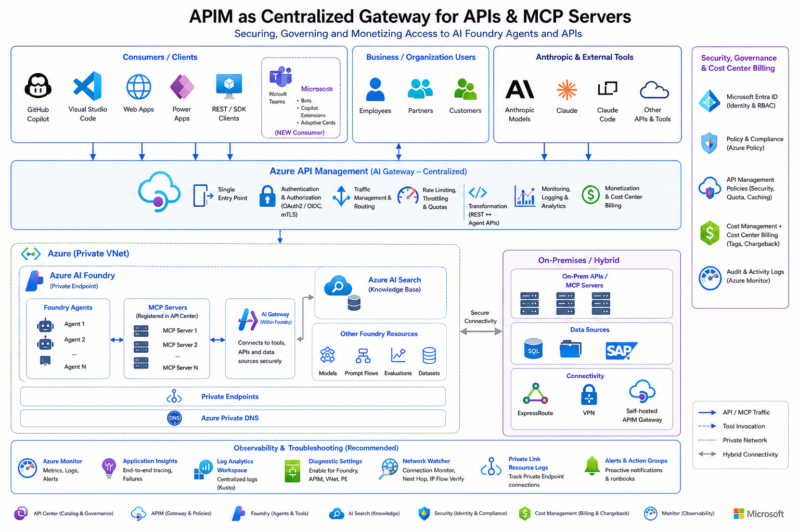
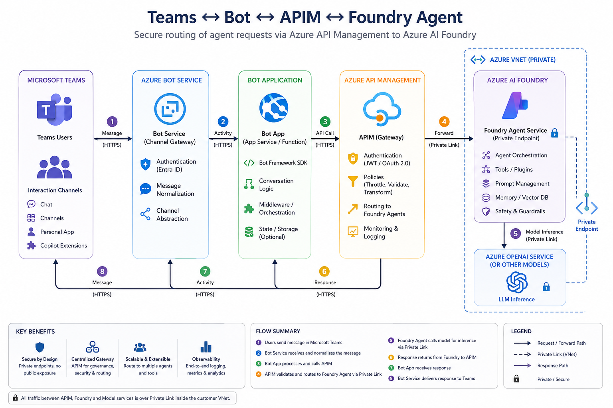
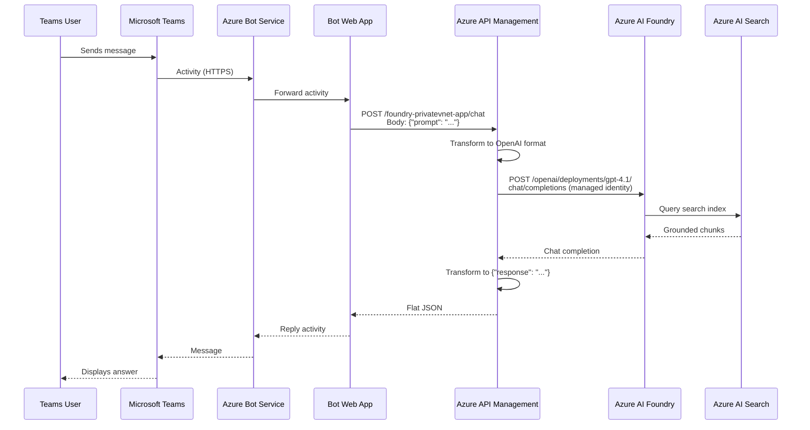

# Foundry Private VNET APIM Gateway

This project demonstrates **Azure API Management as an AI Gateway** in front of a fully private Azure AI Foundry deployment. All Foundry and Azure AI Search traffic is locked inside a private Azure Virtual Network; APIM sits at the VNet boundary as the single policy-enforcement and routing plane for every client request.

The primary case study is **publishing AI agents to Microsoft Teams**. Each Foundry agent is surfaced as a Teams API-based message extension. Users open the compose box in any Teams chat, type a question, and receive a grounded AI response — all routed through APIM to a private Foundry project, with no additional backend App Service required.

## Why APIM as the AI Gateway

Traditional AI solutions add an intermediate API layer (FastAPI, Flask, App Service) between clients and the AI platform. This project removes that layer and puts APIM in that role:

| Concern | How APIM handles it |
|---------|---------------------|
| Authentication | System-assigned managed identity with `Cognitive Services User` role on Foundry |
| Request transformation | Policy rewrites flat `{"prompt": "..."}` into OpenAI chat completions format |
| Response transformation | Policy flattens the completion back to `{"response": "..."}` for Teams adaptive cards |
| Routing | Named backends per Foundry project, no extra DNS or reverse-proxy config |
| Observability | APIM diagnostics to Log Analytics in one place |
| Private networking | Backend URL points to Foundry private endpoint; APIM is the only public surface |

## Architecture



### Teams → Bot → APIM → Foundry data flow





The API-based message extension path (compose box) is shorter — Teams calls APIM `/chat` directly and renders the response as an Adaptive Card, bypassing the Bot Service entirely.

## Technologies Used

| Technology | Role |
|------------|------|
| **Azure API Management** | AI Gateway — policy enforcement, auth, request/response transformation, routing |
| **Azure AI Foundry** | Agent hosting, model inference (`gpt-4.1`), private endpoint access |
| **Azure AI Search** | Grounding data store for both agents; Cosmos DB-backed indexers |
| **Azure Cosmos DB** | Source document store for Search indexer content |
| **Azure Bot Service** | Teams channel registration and activity relay |
| **Azure Functions** (Python 3.11) | Bot application runtime (Linux consumption plan) |
| **Microsoft Teams** | End-user chat interface via API-based message extensions |
| **Terraform** | Infrastructure provisioning (VNet, private endpoints, DNS, APIM, bot) |
| **Azure VNet + Private Endpoints** | Network isolation for Foundry and Search |
| **Private DNS Zones** | Name resolution for private endpoints inside the VNet |
| **GitHub Actions + OIDC** | CI/CD with federated credentials (no client secret) |
| **PowerShell** | Deployment automation, APIM configuration, packaging, smoke tests |
| **Python 3.11** | Bot function, provisioning scripts, test scripts |

## Project File Structure

```
FoundryPrivateVNET-APIM-Gateway/
├── main.tf                        # Terraform root — VNet, private endpoints, bot, optional App Services
├── main.tfvars.json               # Terraform variable values (region, SKUs, resource names)
├── outputs.tf                     # Terraform outputs
│
├── config/
│   ├── __init__.py                # Python module — loads and caches all config JSON files
│   ├── agent_config.json          # Foundry agent definitions (name, model, instructions)
│   ├── azure_resources.json       # Central resource map (APIM, Foundry, Search, Cosmos, App Services)
│   ├── document_config.json       # Sample document metadata for Search index seeding
│   ├── prompts_config.json        # Sample prompts for smoke-testing each agent
│   ├── search_config.json         # Search index and indexer names per use case
│   └── storage_config.json        # Storage notes (Cosmos DB-backed, no blob containers)
│
├── openapi/
│   └── foundry-privatevnet-app.openapi.json  # OpenAPI spec imported into APIM
│
├── Agent-Packages/
│   ├── Tax-PDF-Forms-Agent/
│   │   ├── manifest.json              # Teams app manifest (v1.19)
│   │   ├── apiSpecificationFile.json  # OpenAPI spec → APIM /chat endpoint
│   │   ├── color.png                  # 192x192 color icon
│   │   ├── outline.png                # 32x32 outline icon
│   │   └── Tax-PDF-Forms-Agent.zip    # Sideloadable Teams package
│   └── Eng-Design-PPT-Agent/
│       ├── manifest.json
│       ├── apiSpecificationFile.json
│       ├── color.png
│       ├── outline.png
│       └── Eng-Design-PPT-Agent.zip
│
├── bot-function/                  # Azure Function App — Bot Framework messaging endpoint
├── bot-deploy.zip                 # Pre-built bot function deployment archive
├── server.py                      # Optional local API server
│
├── scripts/
│   ├── deploy.ps1                 # Main deployment orchestrator
│   ├── configure-apim.ps1         # APIM API/product/policy setup
│   ├── configure-foundry-ai-gateway.ps1  # Foundry OpenAI gateway APIM surface
│   ├── ensure-foundry-search-connection.ps1
│   ├── package-teams-agents.ps1   # Zips each Agent-Package folder
│   ├── provision-source-use-cases.ps1    # Source-driven Search + Foundry agent provisioning
│   ├── clone-search-assets.ps1    # Delegates to source-driven provisioning
│   ├── clone-foundry-agents.ps1   # Delegates to source-driven provisioning
│   └── test-sample-prompts.ps1    # APIM smoke tests
│
├── api/                           # Optional App Service API layer
├── ui/                            # Optional App Service UI layer
├── requirements.txt               # Python dependencies
├── requirements-api.txt
├── requirements-deploy.txt
│
└── docs/
    ├── architecture.png           # Solution architecture diagram
    ├── Teams-Bot-APIM-FoundryAgent.png  # End-to-end data flow diagram
    ├── best-practices.md          # APIM + Foundry best practices
    ├── Prompts.txt                # Demo prompts
    └── Screenshots/               # Portal screenshots of APIM and Foundry gateway config
```

## Solution Overview

The deployed topology is:

- **Azure AI Foundry** project with private endpoint access (no public Foundry endpoint exposed)
- **Azure AI Search** with private endpoint access, Cosmos DB-backed indexers
- **Azure API Management** as the public gateway — imports the OpenAPI spec, applies policies, routes to Foundry via private link
- **VNet** with dedicated subnets for APIM internal mode, private endpoints, and the bot function
- **Private DNS zones** for Foundry and Search name resolution inside the VNet
- **Azure Bot Service** + **Function App** for Teams chat channel (optional; API-based message extensions work without it)
- **Log Analytics** for unified diagnostics

## Use Cases

Both agents are grounded on Cosmos DB-backed Azure AI Search indexes:

| Agent | Search Index | Documents |
|-------|-------------|-----------|
| `Tax-PDF-Forms-Agent` | `tax-pdf-forms-index` | 388 |
| `Eng-Design-PPT-Agent` | `eng-design-ppt-index` | 100 |

- **Tax PDF Forms** — answers questions about US state tax exemption forms sourced from PDF content
- **Engineering Design PPT** — answers questions about architecture decisions and milestones from engineering design presentations

Both agents use `gpt-4.1` and are grounded exclusively through `azure_ai_search` (no web search).

## Teams Agent Packages

Each Foundry agent is published to Microsoft Teams as an API-based message extension. Users invoke the agent from the Teams compose box, send a question, and receive the agent's response — all routed through APIM with no bot registration required.

### Package structure

```
Agent-Packages/
├── Tax-PDF-Forms-Agent/
│   ├── manifest.json              # Teams app manifest (v1.19)
│   ├── apiSpecificationFile.json  # OpenAPI spec pointing to APIM /chat endpoint
│   ├── color.png                  # 192x192 color icon
│   ├── outline.png                # 32x32 outline icon (white + transparent)
│   └── Tax-PDF-Forms-Agent.zip
└── Eng-Design-PPT-Agent/
    ├── manifest.json
    ├── apiSpecificationFile.json
    ├── color.png
    ├── outline.png
    └── Eng-Design-PPT-Agent.zip
```

### How it works

Each package uses a `composeExtensions` entry with `composeExtensionType: "apiBased"`. Teams reads the bundled `apiSpecificationFile.json` (an OpenAPI spec) to know how to call the APIM `/chat` endpoint. When the user types a question in the compose box, Teams sends a POST to `https://ai-gateway-apim-poc-my.azure-api.net/foundry-privatevnet-app/api/chat` with the `prompt` and `use_case`, and renders the response as an adaptive card.

### Manifest fields

Each `manifest.json` follows the [Teams manifest schema v1.19](https://developer.microsoft.com/json-schemas/teams/v1.19/MicrosoftTeams.schema.json). Key fields to keep aligned with the deployment:

| Field | Purpose | Current value |
|-------|---------|---------------|
| `id` | Unique app GUID | Differs per agent |
| `developer.websiteUrl` | APIM gateway base URL | `https://ai-gateway-apim-poc-my.azure-api.net` |
| `composeExtensions[].apiSpecificationFile` | Bundled OpenAPI spec | `apiSpecificationFile.json` |
| `validDomains` | Allowed domain for API calls | `["ai-gateway-apim-poc-my.azure-api.net"]` |

If you change the APIM service, update `developer.*Url`, `validDomains` in both manifests, and the `servers[].url` in both `apiSpecificationFile.json` files.

### Icon requirements

Teams enforces strict icon rules:

| Icon | File | Size | Rules |
|------|------|------|-------|
| Color | `color.png` | 192x192 px | Full color, PNG format |
| Outline | `outline.png` | 32x32 px | White and transparent only, PNG format |

### Repackaging

The packaging script zips each agent folder's `manifest.json`, `apiSpecificationFile.json`, `color.png`, and `outline.png` into a `.zip`:

```powershell
./scripts/package-teams-agents.ps1
```

This runs automatically during `./scripts/deploy.ps1` and the GitHub Actions `post-deploy` job. To skip packaging during local deployment, use `-SkipPackage`.

### Publishing via Teams Developer Portal

The [Teams Developer Portal](https://dev.teams.microsoft.com) lets you test and publish apps without tenant admin approval:

1. Go to [https://dev.teams.microsoft.com](https://dev.teams.microsoft.com).
2. Click **Apps** → **Import app**.
3. Upload the `.zip` file (e.g. `Agent-Packages/Tax-PDF-Forms-Agent/Tax-PDF-Forms-Agent.zip`).
4. The portal validates the manifest, icons, schema, and OpenAPI spec. Fix any errors before proceeding.
5. Click **Preview in Teams** to install the app for yourself.
6. In Teams, open the compose box in any chat, click the **...** (extensions) menu, and select the agent.
7. Type your question — Teams calls the APIM `/chat` endpoint and shows the response.
8. Repeat for `Eng-Design-PPT-Agent.zip`.

This bypasses the Teams Admin Center approval flow and installs the app only for your account.

### Publishing via VS Code

Install the [Teams Toolkit](https://marketplace.visualstudio.com/items?itemName=TeamsDevApp.ms-teams-vscode-extension) extension for VS Code. It provides manifest validation, sideloading, and debugging directly from the editor:

1. Install the extension from the VS Code Marketplace.
2. Open the `Agent-Packages/<AgentName>` folder.
3. Use **Teams Toolkit: Validate manifest** to check the manifest before uploading.
4. Use **Teams Toolkit: Zip Teams Metadata Package** or run `./scripts/package-teams-agents.ps1`.
5. Use **Teams Toolkit: Upload to Teams** to sideload the package for testing.

### Common packaging errors

| Error | Cause | Fix |
|-------|-------|-----|
| `packageName` not defined | Deprecated field in manifest | Remove the `packageName` property |
| Color icon wrong dimension | `color.png` is not 192x192 | Regenerate as 192x192 PNG |
| Outline icon not transparent | `outline.png` has non-transparent background | Regenerate as 32x32, white on transparent PNG |
| No Supported Products | Manifest has no `composeExtensions` or `staticTabs` | Add a `composeExtensions` entry with `composeExtensionType: "apiBased"` |
| Unsupported schema type (arrays) | Request body uses array types | Flatten to simple string properties; use APIM policy to transform into arrays |
| `apiResponseRenderingTemplateFile` not defined | Wrong manifest schema version | Use `devPreview` manifest version |
| `previewCardTemplate` missing | Response template missing required field | Add `previewCardTemplate` with at least a `title` |

## Bot Registration

The Teams chat experience requires an Azure Bot Service registration backed by a Function App:

| Resource | Value |
|----------|-------|
| Bot name | `foundry-privatevnet-bot` |
| App ID | `37a8fd15-4b3c-4289-9e8c-19b65120b844` |
| App type | SingleTenant |
| Messaging endpoint | `https://func-fdryvnetgw-bot-eastus.azurewebsites.net/api/messages` |
| Function App | `func-fdryvnetgw-bot-eastus` (Linux consumption, Python 3.11) |
| Channel | Microsoft Teams |

The bot function receives messages from Teams, extracts the user text, calls the APIM `/chat` endpoint, and replies with the response. The function code is in [bot-function/](bot-function/).

All bot infrastructure (Function App, storage account, consumption plan, bot registration, Teams channel) is managed by Terraform and deployed automatically.

### Bot app secret

The bot app password is stored as a Terraform variable `bot_app_password`. Set it via environment variable:

```powershell
$env:TF_VAR_bot_app_password = "your-secret-here"
terraform apply -var-file=main.tfvars.json
```

Or add `BOT_APP_PASSWORD` as a GitHub Actions secret and pass it in the workflow.

## APIM Configuration

> **Note:** All APIM paths below are deployed inside a private Azure VNet and are not reachable from the public internet. They are accessible only from resources connected to the same VNet or via VNet peering/VPN.

The deployment configures three APIM surfaces:

- **App backend API** at `{apim_gateway_url}/foundry-privatevnet-app` — imported from the OpenAPI spec, subscription-free
- **Foundry OpenAI gateway** at `{apim_gateway_url}/002-ai-poc-private/openai` — proxies to the Foundry account with managed identity
- **Teams chat endpoint** at `{apim_gateway_url}/foundry-privatevnet-app/chat` — APIM operation-level policy transforms flat `{prompt}` into OpenAI chat completions

Replace `{apim_gateway_url}` with the value of `apim.gateway_url` from `config/azure_resources.json`.

```powershell
./scripts/configure-apim.ps1
./scripts/configure-foundry-ai-gateway.ps1
```

### Chat operation policy

The `/chat` operation on the `foundry-privatevnet-app` API uses an APIM policy that:

1. Extracts the `prompt` field from the incoming `{"prompt": "..."}` request
2. Rewrites the backend to `https://002-ai-poc-private.services.ai.azure.com/openai/deployments/gpt-4.1/chat/completions`
3. Authenticates with Foundry using the APIM system-assigned managed identity (`Cognitive Services User`)
4. Transforms the flat prompt into OpenAI chat format with system instructions
5. Transforms the OpenAI response back to flat `{"response": "...", "use_case": "..."}` for the Teams adaptive card

This eliminates the need for a backend API app service. The Teams message extension calls APIM directly, and APIM handles all Foundry communication.

## AI Gateway Screenshots

### Foundry AI Gateway list

The Foundry Admin portal shows the `ai-gateway-apim-poc-my` gateway registered at the Foundry account level in the `eastus` region, linked to one resource and one project.


### Foundry AI Gateway details

Drilling into the gateway shows its basic configuration: region `eastus`, resource group `ai-myaacoub`, pricing tier `BasicV2`, and endpoint `https://ai-gateway-apim-poc-my.azure-api.net`. The `proj-default` project is listed with Gateway status **Enabled** and parent resource `002-ai-poc-private`.


### APIM — Add Foundry API endpoint

In the Azure Portal, the APIM service `ai-gateway-apim-poc-my` is configured with the `002-ai-poc-private` Azure AI Service API. Client compatibility is set to **OpenAI**, and the endpoint resolves to `https://ai-gateway-apim-poc-my.azure-api.net/002-ai-poc-private/openai`. The wizard automatically activates the APIM system-assigned managed identity and assigns the **Azure AI User** role on the selected Azure AI service.


### APIM — Test Foundry API

The APIM Test console shows the imported `002-ai-poc-private` API with all OpenAI-compatible operations (assistants, threads, runs, messages, vector stores). The screenshot demonstrates the "Returns a list of assistants" GET operation with the full request URL routed through the APIM gateway.


## Configuration

All runtime configuration lives in the `config/` folder. These JSON files are loaded by `config/__init__.py` and shared across deployment scripts, provisioning scripts, and the API layer.

| File | Purpose |
|------|---------|
| `agent_config.json` | Foundry agent definitions — one entry per use case with `name`, `model_deployment`, and `instructions` |
| `azure_resources.json` | Central map of all Azure resource IDs, endpoints, and per-use-case paths (APIM, Foundry, Search, Cosmos DB, App Services) |
| `document_config.json` | Sample document metadata (filename, doc_id, title) used to seed and validate each use-case Search index |
| `prompts_config.json` | Sample prompts grouped by query type (`keyword`, `semantic`, `agent`) for smoke-testing each agent |
| `search_config.json` | Azure AI Search index and indexer names for each use case, used by the clone and provisioning scripts |
| `storage_config.json` | Storage notes for the solution — document that this solution uses Cosmos DB-backed content rather than blob containers |
| `__init__.py` | Python module that loads and caches each JSON file; exposes typed accessors (`azure_resources()`, `agent_config()`, `prompts_config()`, `document_config()`, `search_config()`, `storage_config()`) used throughout the codebase |

### azure_resources.json

This is the primary config file. It contains:

- `subscription_id`, `resource_group`, `location` — target Azure environment
- `apim` — APIM service resource ID, gateway URL, API path, product name, and API names (app backend and Foundry gateway)
- `foundry` — Foundry account name, resource ID, project endpoint, source project endpoint, and Search connection name
- `search` — target and source Search service names, resource IDs, and endpoint
- `cosmosdb` — Cosmos DB account name, endpoint, resource ID, database, and container
- `app_services` — optional API and UI App Service names and URLs (only used when `deploy_api`/`deploy_ui` are enabled)
- `use_cases` — per-use-case label, agent name, APIM agent path, and Search asset names

### agent_config.json

Defines the two Foundry agents provisioned into the private Foundry project:

- `Tax-PDF-Forms-Agent` — uses `gpt-4.1`, grounded on the tax PDF Search index
- `Eng-Design-PPT-Agent` — uses `gpt-4.1`, grounded on the engineering design PPT Search index

> **Note:** All APIM and Foundry endpoints in `azure_resources.json` are deployed inside a private Azure VNet. They are not reachable from the public internet. Replace the values in `azure_resources.json` with your own resource details before deploying to a different environment.

## Deployment

Local prerequisites:

- Terraform 1.6+
- Azure CLI
- Python 3.11+

Main workflow:

```powershell
./scripts/deploy.ps1
```

That script runs Terraform validate plus a direct apply by default, then clones `https://github.com/csdmichael/AI-Search-Blob-Storage` at runtime and applies this repo's private Foundry, Search, and Cosmos resource settings to provision the retained Search indexes and Foundry agents, configures the APIM surface, configures the Foundry OpenAI APIM gateway, generates Teams packages, and runs sample prompt tests.

App Service infrastructure is opt-in. Use `-DeployApi` and `-DeployUi` only when you want Terraform to manage the web apps and their shared App Service plan.

For faster iterative deployments, skip steps you are not changing:

```powershell
./scripts/deploy.ps1 -SkipTests -SkipPackage
```

To include App Service resources in a local deployment run:

```powershell
./scripts/deploy.ps1 -DeployApi -DeployUi
```

If you want the slower two-step Terraform flow with a saved plan file, use:

```powershell
./scripts/deploy.ps1 -DetailedPlan
```

## GitHub Actions Setup

The GitHub Actions deployment path is already wired for OpenID Connect with a user-assigned managed identity, so no client secret is required.

Provisioned Azure identity:

- identity name: `gha-foundry-privatevnet-oidc`
- client id: `b01a1a97-faef-4d58-8a9a-764d0b2697ec`
- tenant id: `b158173c-91f6-4f99-b5e9-aa9bcb463863`
- subscription id: `86b37969-9445-49cf-b03f-d8866235171c`

Federated credentials configured on that identity:

- `repo:csdmichael/FoundryPrivateVNET-APIM-Gateway:ref:refs/heads/main`

Azure RBAC granted to that identity:

- `Contributor` on resource group `ai-myaacoub`
- `Azure AI Developer` on `002-ai-poc-private`
- `Azure AI Developer` on `001-ai-poc`
- `Search Service Contributor` on `aisearch-poc-myaacoub`

Repository secrets configured in `csdmichael/FoundryPrivateVNET-APIM-Gateway`:

| Secret | Value |
|--------|-------|
| `AZURE_CLIENT_ID` | `b01a1a97-faef-4d58-8a9a-764d0b2697ec` |
| `AZURE_TENANT_ID` | `b158173c-91f6-4f99-b5e9-aa9bcb463863` |
| `AZURE_SUBSCRIPTION_ID` | `86b37969-9445-49cf-b03f-d8866235171c` |
| `API_WEBAPP_NAME` | `foundry-privatevnet-api` |
| `UI_WEBAPP_NAME` | `foundry-privatevnet-ui` |
| `APP_API_BASE_URL` | `https://ai-gateway-apim-poc-my.azure-api.net/foundry-privatevnet-app` |

GitHub environments are not required by the current workflow. The deployment runs as a single pipeline against one Terraform configuration and authenticates through the `main` branch OIDC subject.

When you run the `deploy` workflow manually from GitHub Actions, `deploy_api` and `deploy_ui` default to `false` and let you opt into either app deployment. Pushes to `main` run the infrastructure and post-deploy gateway/provisioning flow without redeploying the App Services.

Recommended operator flow:

1. Push to `main` or run the `deploy` workflow manually from GitHub Actions.
2. Let the `terraform`, `deploy-bot-function`, and `post-deploy` jobs finish.
3. Validate the APIM chat and Foundry OpenAI gateway paths from within the private VNet (these endpoints are not publicly reachable).
4. Import the Teams agent packages and test in Teams.

Notes:

- The workflow uses a single Terraform configuration and a branch-scoped OIDC credential for `main`.
- The bot function is deployed automatically on every push to `main`.
- The sample prompt smoke test runs through APIM.
- Post-deploy provisioning clones `https://github.com/csdmichael/AI-Search-Blob-Storage` at runtime and overlays this repo's private Foundry, Search, and Cosmos resource settings.
- The private Foundry project uses the `aisearchpocmyaacoub` Azure AI Search connection created by `scripts/ensure-foundry-search-connection.ps1`.
- The private Search service must have a system-assigned managed identity enabled.
- That Search managed identity must have Cosmos DB account reader plus Cosmos SQL data access on `cosmos-ai-poc`.
- The private Search service must have an approved shared private link to `cosmos-ai-poc` named `cosmos-ai-poc-sql` before Cosmos-backed Search indexers can populate data.

## Source-Driven Search And Agent Provisioning

The deployment no longer clones live Azure Search objects or live Foundry agents from the source environment.

Instead, the post-deploy step clones `https://github.com/csdmichael/AI-Search-Blob-Storage`, overlays the private target resource settings from this repo, and provisions only the retained use cases:

- `tax_pdf_forms`
- `eng_design_ppt`

The provisioning wrapper is:

```powershell
./scripts/provision-source-use-cases.ps1
```

Compatibility entrypoints still exist:

```powershell
./scripts/clone-search-assets.ps1
./scripts/clone-foundry-agents.ps1
```

Those wrappers now delegate to the source-driven provisioning flow instead of cloning live Azure objects.

Important network prerequisite:

- `aisearch-poc-myaacoub` must be able to reach `cosmos-ai-poc` through an approved Search shared private link resource named `cosmos-ai-poc-sql`.

## Demo Script

Use this sequence for a live walkthrough after the GitHub Actions deployment completes:

> **Note:** The APIM gateway is deployed inside a private Azure VNet. Steps 1 and 2 below require network access to the VNet (e.g., from an Azure VM, Bastion, or VPN-connected machine).

1. Test the APIM chat endpoint with a sample prompt (requires private VNet access):

```powershell
$apimBase = (Get-Content config/azure_resources.json | ConvertFrom-Json).apim.gateway_url
$body = @{prompt="What does the Maine nonprofit certificate say about filing requirements?"} | ConvertTo-Json
Invoke-RestMethod -Method Post -Uri "$apimBase/foundry-privatevnet-app/chat" -ContentType "application/json" -Body $body
```

2. Browse the Foundry OpenAI gateway path via the APIM gateway URL in `config/azure_resources.json` (requires private VNet access).
3. Import the Teams agent packages and preview in Teams.
4. Run the packaged smoke tests:

```powershell
./scripts/test-sample-prompts.ps1
```

5. Use prompts from [docs/Prompts.txt](docs/Prompts.txt) to demo both agents.
6. Show the generated Teams packages under `Agent-Packages/`.

## Sample Prompts and Testing

Both agents use only `azure_ai_search` as their grounding tool — no web search is allowed. Each agent queries its dedicated index on `aisearch-poc-myaacoub`:

| Agent | Search Index | Documents |
|-------|-------------|-----------|
| Tax-PDF-Forms-Agent | `tax-pdf-forms-index` | 388 |
| Eng-Design-PPT-Agent | `eng-design-ppt-index` | 100 |

### Tax PDF Forms Agent

| Prompt | Expected behavior |
|--------|-------------------|
| Summarize the renewal requirements for the Indiana tax exemption certificate. | Describes Form ST-105 and its validity period |
| What does the Maine nonprofit certificate say about filing requirements? | References Section 501(c)(3) requirements and authorized official signatures |
| Which fields require notarization in the Michigan exemption form? | Cites specific notarization fields from the Michigan form |
| What documentation is required for a West Virginia resale certificate? | Lists required documentation for West Virginia resale |
| What deadline is listed for the Alabama property tax exemption form? | Identifies deadline from the Alabama exemption form |

### Engineering Design PPT Agent

| Prompt | Expected behavior |
|--------|-------------------|
| Summarize the system architecture described in the engineering design deck. | Describes frontend, backend, monitoring, and control components |
| What trade-offs are mentioned for the preferred design option? | Lists environmental, traffic, property, and access trade-offs |
| List any milestone dates or next steps called out in the presentations. | Extracts milestone dates and action items |
| What architecture decisions are described in the engineering design presentations? | Summarizes key architecture choices |
| Which risks or action items were called out in the design review decks? | Identifies risk items from design reviews |

### Running tests

Run the automated smoke tests via APIM (requires private VNet access or a VPN-connected machine). The `APP_API_BASE_URL` is read from `config/azure_resources.json` automatically, but you can override it:

```powershell
$env:APP_API_BASE_URL = (Get-Content config/azure_resources.json | ConvertFrom-Json).apim.gateway_url + "/foundry-privatevnet-app/api"
./scripts/test-sample-prompts.ps1
```

Or run all prompts interactively during local development:

```powershell
./scripts/deploy.ps1 -SkipTerraform -SkipApim -SkipPackage
```

## Terraform Notes

The Terraform implementation manages:

- VNet, subnets, private endpoints, and private DNS for Foundry and Search
- Log Analytics for diagnostics
- Bot Function App (Linux consumption plan, Python 3.11) as the Teams messaging endpoint
- Azure Bot Service registration with Teams channel
- Storage account for the Function App
- Optional App Service resources (API/UI) when `deploy_api`/`deploy_ui` are enabled

Validate region, SKU, and existing resource assumptions in [main.tfvars.json](main.tfvars.json) before running apply in a different subscription or environment.
