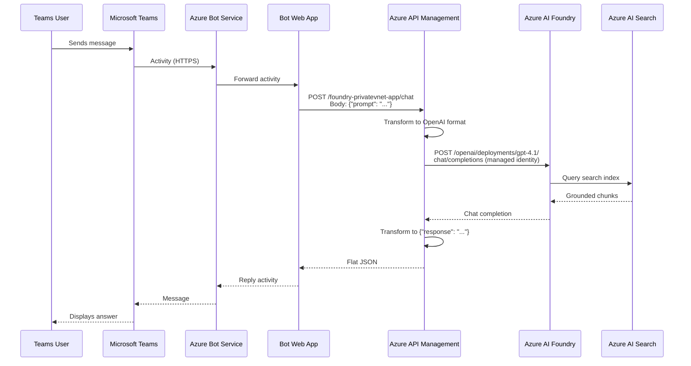
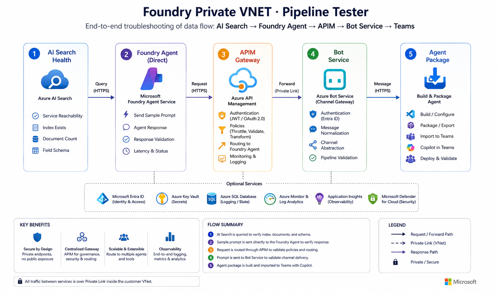

# Foundry Private VNET APIM Gateway

This project demonstrates **Azure API Management as an AI Gateway** in front of a fully private Azure AI Foundry deployment. All Foundry and Azure AI Search traffic is locked inside a private Azure Virtual Network; APIM sits at the VNet boundary as the single policy-enforcement and routing plane for every client request.

The primary case study is **publishing AI agents to Microsoft Teams**. Each Foundry agent is surfaced as a Teams API-based message extension. Users open the compose box in any Teams chat, type a question, and receive a grounded AI response — all routed through APIM to a private Foundry project, with no additional backend App Service required.

## Index

- [Why APIM as the AI Gateway](#why-apim-as-the-ai-gateway)
- [Architecture](#architecture)
- [Technologies Used](#technologies-used)
- [Project File Structure](#project-file-structure)
- [Solution Overview](#solution-overview)
- [Use Cases](#use-cases)
- [Teams Agent Packages](#teams-agent-packages)
- [Bot Registration](#bot-registration)
- [APIM Configuration](#apim-configuration)
- [AI Gateway Screenshots](#ai-gateway-screenshots)
- [Pipeline Testing UI](#pipeline-testing-ui)
- [Configuration](#configuration)
- [Deployment](#deployment)
- [GitHub Actions Setup](#github-actions-setup)
- [Source-Driven Search And Agent Provisioning](#source-driven-search-and-agent-provisioning)
- [Sample Prompts and Testing](#sample-prompts-and-testing)
- [Terraform Notes](#terraform-notes)

## Why APIM as the AI Gateway

Traditional AI solutions add an intermediate API layer (FastAPI, Flask, App Service) between clients and the AI platform. This project removes that layer and puts APIM in that role:

| Concern | How APIM handles it |
|---------|---------------------|
| Authentication | System-assigned managed identity with `Cognitive Services User` role on Foundry |
| Request transformation | Policy rewrites flat `{"prompt": "..."}` into OpenAI chat completions format |
| Response transformation | Policy flattens the completion back to `{"response": "..."}` for Teams adaptive cards |
| Routing | Named backends per Foundry project, no extra DNS or reverse-proxy config |
| Observability | APIM diagnostics to Log Analytics in one place |
| Private networking | Backend URL points to Foundry private endpoint; APIM is the only public surface |

## Architecture


### Teams → Bot → APIM → Foundry data flow




The API-based message extension path (compose box) is shorter — Teams calls APIM `/chat` directly and renders the response as an Adaptive Card, bypassing the Bot Service entirely.

### Data pipeline sequence

The pipeline tester UI validates each hop in this sequence. When troubleshooting, failures at any stage pinpoint the broken layer:



## Technologies Used

| Technology | Role |
|------------|------|
| **Azure API Management** | AI Gateway — policy enforcement, auth, request/response transformation, routing |
| **Azure AI Foundry** | Agent hosting, model inference (`gpt-4.1`), private endpoint access |
| **Azure AI Search** | Grounding data store for both agents; Cosmos DB-backed indexers |
| **Azure Cosmos DB** | Source document store for Search indexer content |
| **Azure Bot Service** | Teams channel registration and activity relay |
| **Azure Functions** (Python 3.11) | Bot application runtime (Linux consumption plan) |
| **Microsoft Teams** | End-user chat interface via API-based message extensions |
| **Ionic / Angular** | Pipeline testing UI — responsive dashboard for end-to-end troubleshooting |
| **Terraform** | Infrastructure provisioning (VNet, private endpoints, DNS, APIM, bot) |
| **Azure VNet + Private Endpoints** | Network isolation for Foundry and Search |
| **Private DNS Zones** | Name resolution for private endpoints inside the VNet |
| **GitHub Actions + OIDC** | CI/CD with federated credentials (no client secret) |
| **PowerShell** | Deployment automation, APIM configuration, packaging, smoke tests |
| **Python 3.11** | Bot function, provisioning scripts, test scripts |

## Project File Structure

```
FoundryPrivateVNET-APIM-Gateway/
├── main.tf                        # Terraform root — VNet, private endpoints, bot, optional App Services
├── main.tfvars.json               # Terraform variable values (region, SKUs, resource names)
├── outputs.tf                     # Terraform outputs
│
├── config/
│   ├── __init__.py                # Python module — loads and caches all config JSON files
│   ├── agent_config.json          # Foundry agent definitions (name, model, instructions)
│   ├── azure_resources.json       # Central resource map (APIM, Foundry, Search, Cosmos, App Services)
│   ├── document_config.json       # Sample document metadata for Search index seeding
│   ├── prompts_config.json        # Sample prompts for smoke-testing each agent
│   ├── search_config.json         # Search index and indexer names per use case
│   └── storage_config.json        # Storage notes (Cosmos DB-backed, no blob containers)
│
├── openapi/
│   └── foundry-privatevnet-app.openapi.json  # OpenAPI spec imported into APIM
│
├── Agent-Packages/
│   ├── Tax-PDF-Forms-Agent/
│   │   ├── manifest.json              # Teams app manifest (v1.19)
│   │   ├── apiSpecificationFile.json  # OpenAPI spec → APIM /chat endpoint
│   │   ├── color.png                  # 192x192 color icon
│   │   ├── outline.png                # 32x32 outline icon
│   │   └── Tax-PDF-Forms-Agent.zip    # Sideloadable Teams package
│   └── Eng-Design-PPT-Agent/
│       ├── manifest.json
│       ├── apiSpecificationFile.json
│       ├── color.png
│       ├── outline.png
│       └── Eng-Design-PPT-Agent.zip
│
├── bot-function/                  # Azure Function App — Bot Framework messaging endpoint
├── bot-deploy.zip                 # Pre-built bot function deployment archive
├── server.py                      # Optional local API server
│
├── scripts/
│   ├── deploy.ps1                 # Main deployment orchestrator
│   ├── deploy-helpers.sh          # Shared bash deploy helper — ARM-based zip deploy with status polling
│   ├── configure-apim.ps1         # APIM API/product/policy setup
│   ├── configure-foundry-ai-gateway.ps1  # Foundry OpenAI gateway APIM surface
│   ├── ensure-foundry-search-connection.ps1
│   ├── package-teams-agents.ps1   # Zips each Agent-Package folder
│   ├── export-agents-generate-packages.ps1  # Export agents from Foundry and generate Teams packages
│   ├── provision-source-use-cases.ps1    # Source-driven Search + Foundry agent provisioning
│   ├── clone-search-assets.ps1    # Delegates to source-driven provisioning
│   ├── clone-foundry-agents.ps1   # Delegates to source-driven provisioning
│   └── test-sample-prompts.ps1    # APIM smoke tests
│
├── api/                           # Optional App Service API layer
├── ui/                            # Ionic/Angular testing UI — pipeline troubleshooting dashboard
│   ├── src/app/
│   │   ├── home/                  # Landing page — purpose, quick-start, 5-step pipeline overview
│   │   ├── run-all/               # Run All Tests — sequential runner, continues on failure, full report
│   │   ├── test-search/           # Step 1: AI Search health check (doc count, fields, storage)
│   │   ├── test-foundry/          # Step 2: Foundry Agent direct test (bypasses APIM)
│   │   ├── test-apim/             # Step 3: APIM Gateway test (same prompt through gateway)
│   │   ├── test-bot/              # Step 4: Bot Service test (full Teams pipeline)
│   │   ├── agent-package/         # Step 5: Build/download Teams agent package + Dev Portal link
│   │   ├── shared/                # Reusable KPI badges and master-detail result cards
│   │   ├── services/              # API service, use-case service, device detection service
│   │   ├── chat/                  # Interactive chat page
│   │   ├── prompts/               # Sample prompt browser
│   │   └── documents/             # Document explorer
│   ├── server.js                  # Express static server for production
│   ├── deploy-package.json        # Production-only package.json (Express dependency)
│   └── package.json               # Angular/Ionic dev dependencies
├── requirements.txt               # Python dependencies
├── requirements-api.txt
├── requirements-deploy.txt
│
└── docs/
    ├── architecture.png           # Solution architecture diagram
    ├── Teams-Bot-APIM-FoundryAgent.png  # End-to-end data flow diagram
    ├── best-practices.md          # APIM + Foundry best practices
    ├── demo-script.md             # Live walkthrough script for demos
    ├── Prompts.txt                # Demo prompts
    └── Screenshots/               # Portal screenshots of APIM and Foundry gateway config
```

## Solution Overview

The deployed topology is:

- **Azure AI Foundry** project with private endpoint access (no public Foundry endpoint exposed)
- **Azure AI Search** with private endpoint access, Cosmos DB-backed indexers
- **Azure API Management** as the public gateway — imports the OpenAPI spec, applies policies, routes to Foundry via private link
- **VNet** with dedicated subnets for APIM internal mode, private endpoints, and the bot function
- **Private DNS zones** for Foundry and Search name resolution inside the VNet
- **Azure Bot Service** + **Function App** for Teams chat channel (optional; API-based message extensions work without it)
- **Log Analytics** for unified diagnostics

## Use Cases

Both agents are grounded on Cosmos DB-backed Azure AI Search indexes:

| Agent | Search Index | Documents |
|-------|-------------|-----------|
| `Tax-PDF-Forms-Agent` | `tax-pdf-forms-index` | 388 |
| `Eng-Design-PPT-Agent` | `eng-design-ppt-index` | 100 |

- **Tax PDF Forms** — answers questions about US state tax exemption forms sourced from PDF content
- **Engineering Design PPT** — answers questions about architecture decisions and milestones from engineering design presentations

Both agents use `gpt-4.1` and are grounded exclusively through `azure_ai_search` (no web search).

## Teams Agent Packages

Each Foundry agent is published to Microsoft Teams as an API-based message extension. Users invoke the agent from the Teams compose box, send a question, and receive the agent's response — all routed through APIM with no bot registration required.

### Package structure

```
Agent-Packages/
├── Tax-PDF-Forms-Agent/
│   ├── manifest.json              # Teams app manifest (v1.19)
│   ├── apiSpecificationFile.json  # OpenAPI spec pointing to APIM /chat endpoint
│   ├── color.png                  # 192x192 color icon
│   ├── outline.png                # 32x32 outline icon (white + transparent)
│   └── Tax-PDF-Forms-Agent.zip
└── Eng-Design-PPT-Agent/
    ├── manifest.json
    ├── apiSpecificationFile.json
    ├── color.png
    ├── outline.png
    └── Eng-Design-PPT-Agent.zip
```

### How it works

Each package uses a `composeExtensions` entry with `composeExtensionType: "apiBased"`. Teams reads the bundled `apiSpecificationFile.json` (an OpenAPI spec) to know how to call the APIM `/chat` endpoint. When the user types a question in the compose box, Teams sends a POST to `https://ai-gateway-apim-poc-my.azure-api.net/foundry-privatevnet-app/api/chat` with the `prompt` and `use_case`, and renders the response as an adaptive card.

### Manifest fields

Each `manifest.json` follows the [Teams manifest schema v1.19](https://developer.microsoft.com/json-schemas/teams/v1.19/MicrosoftTeams.schema.json). Key fields to keep aligned with the deployment:

| Field | Purpose | Current value |
|-------|---------|---------------|
| `id` | Unique app GUID | Differs per agent |
| `developer.websiteUrl` | APIM gateway base URL | `https://ai-gateway-apim-poc-my.azure-api.net` |
| `composeExtensions[].apiSpecificationFile` | Bundled OpenAPI spec | `apiSpecificationFile.json` |
| `validDomains` | Allowed domain for API calls | `["ai-gateway-apim-poc-my.azure-api.net"]` |

If you change the APIM service, update `developer.*Url`, `validDomains` in both manifests, and the `servers[].url` in both `apiSpecificationFile.json` files.

### Icon requirements

Teams enforces strict icon rules:

| Icon | File | Size | Rules |
|------|------|------|-------|
| Color | `color.png` | 192x192 px | Full color, PNG format |
| Outline | `outline.png` | 32x32 px | White and transparent only, PNG format |

### Repackaging

The packaging script zips each agent folder's `manifest.json`, `apiSpecificationFile.json`, `color.png`, and `outline.png` into a `.zip`:

```powershell
./scripts/package-teams-agents.ps1
```

Alternatively, the export-and-package script exports live agent definitions from Foundry (via APIM) and regenerates the full Teams packages in one step:

```powershell
./scripts/export-agents-generate-packages.ps1           # export from Foundry + generate packages
./scripts/export-agents-generate-packages.ps1 -PackageOnly  # regenerate packages from config only
```

This runs automatically during `./scripts/deploy.ps1` and the GitHub Actions `post-deploy` job. To skip packaging during local deployment, use `-SkipPackage`.

### Publishing via Teams Developer Portal

The [Teams Developer Portal](https://dev.teams.microsoft.com) lets you test and publish apps without tenant admin approval:

1. Go to [https://dev.teams.microsoft.com](https://dev.teams.microsoft.com).
2. Click **Apps** → **Import app**.
3. Upload the `.zip` file (e.g. `Agent-Packages/Tax-PDF-Forms-Agent/Tax-PDF-Forms-Agent.zip`).
4. The portal validates the manifest, icons, schema, and OpenAPI spec. Fix any errors before proceeding.
5. Click **Preview in Teams** to install the app for yourself.
6. In Teams, open the compose box in any chat, click the **...** (extensions) menu, and select the agent.
7. Type your question — Teams calls the APIM `/chat` endpoint and shows the response.
8. Repeat for `Eng-Design-PPT-Agent.zip`.

This bypasses the Teams Admin Center approval flow and installs the app only for your account.

### Publishing via VS Code

Install the [Teams Toolkit](https://marketplace.visualstudio.com/items?itemName=TeamsDevApp.ms-teams-vscode-extension) extension for VS Code. It provides manifest validation, sideloading, and debugging directly from the editor:

1. Install the extension from the VS Code Marketplace.
2. Open the `Agent-Packages/<AgentName>` folder.
3. Use **Teams Toolkit: Validate manifest** to check the manifest before uploading.
4. Use **Teams Toolkit: Zip Teams Metadata Package** or run `./scripts/package-teams-agents.ps1`.
5. Use **Teams Toolkit: Upload to Teams** to sideload the package for testing.

### Common packaging errors

| Error | Cause | Fix |
|-------|-------|-----|
| `packageName` not defined | Deprecated field in manifest | Remove the `packageName` property |
| Color icon wrong dimension | `color.png` is not 192x192 | Regenerate as 192x192 PNG |
| Outline icon not transparent | `outline.png` has non-transparent background | Regenerate as 32x32, white on transparent PNG |
| No Supported Products | Manifest has no `composeExtensions` or `staticTabs` | Add a `composeExtensions` entry with `composeExtensionType: "apiBased"` |
| Unsupported schema type (arrays) | Request body uses array types | Flatten to simple string properties; use APIM policy to transform into arrays |
| `apiResponseRenderingTemplateFile` not defined | Wrong manifest schema version | Use `devPreview` manifest version |
| `previewCardTemplate` missing | Response template missing required field | Add `previewCardTemplate` with at least a `title` |

## Bot Registration

The Teams chat experience now uses one Azure Bot Service registration per use case, each backed by its own Function App:

| Use case | Bot name | App ID | Messaging endpoint | Function App |
|----------|----------|--------|--------------------|--------------|
| Tax PDF Forms | `foundry-privatevnet-tax-bot` | `9590abf6-d0df-477b-b16c-1298dfbed5cc` | `https://func-fdryvnetgw-tax-bot-eastus.azurewebsites.net/api/messages` | `func-fdryvnetgw-tax-bot-eastus` |
| Eng Design PPT | `foundry-privatevnet-eng-bot` | `fdacafcf-352a-4443-8805-402f5780ae67` | `https://func-fdryvnetgw-eng-bot-eastus.azurewebsites.net/api/messages` | `func-fdryvnetgw-eng-bot-eastus` |

Each bot function receives messages from Teams, sets its use-case-specific routing, calls the APIM `/chat` endpoint, and replies with the response. The function code is in [bot-function/](bot-function/).

All bot infrastructure (Function App, storage account, consumption plan, bot registration, Teams channel) is managed by Terraform and deployed automatically.

### Bot endpoints and manual tests

Use these endpoints to validate the deployed bot web apps:

| Use case | Health endpoint | Bot Framework messaging endpoint |
|----------|-----------------|----------------------------------|
| Tax PDF Forms | `https://func-fdryvnetgw-tax-bot-eastus.azurewebsites.net/api/health` | `https://func-fdryvnetgw-tax-bot-eastus.azurewebsites.net/api/messages` |
| Eng Design PPT | `https://func-fdryvnetgw-eng-bot-eastus.azurewebsites.net/api/health` | `https://func-fdryvnetgw-eng-bot-eastus.azurewebsites.net/api/messages` |

The `/api/messages` endpoint is the Bot Framework webhook used by Teams and Azure Bot Service. It expects a signed Bot Framework activity, so it is not useful for anonymous smoke tests from PowerShell or `curl`. For manual verification, use `/api/health` to confirm the bot app is running and use the APIM chat API below to validate the same prompt-routing path the bot uses after it receives a Teams message.

PowerShell health checks:

```powershell
Invoke-WebRequest https://func-fdryvnetgw-tax-bot-eastus.azurewebsites.net/api/health
Invoke-WebRequest https://func-fdryvnetgw-eng-bot-eastus.azurewebsites.net/api/health
```

Sample APIM chat smoke tests using prompts from the sample prompt list:

```powershell
$taxBody = @{
    prompt   = "In lq_tax_exemption_IN_001_yellow.pdf, what is the stated purpose of the Indiana tax exemption certificate and who is expected to use it?"
    use_case = "tax_pdf_forms"
} | ConvertTo-Json

Invoke-RestMethod \
    -Method Post \
    -Uri "https://ai-gateway-apim-poc-my.azure-api.net/foundry-privatevnet-app/chat" \
    -ContentType "application/json" \
    -Body $taxBody

$engBody = @{
    prompt   = "In engineering_design_review_001.pptx, summarize the problem statement, project goal, and design scope described in the opening slides."
    use_case = "eng_design_ppt"
} | ConvertTo-Json

Invoke-RestMethod \
    -Method Post \
    -Uri "https://ai-gateway-apim-poc-my.azure-api.net/foundry-privatevnet-app/chat" \
    -ContentType "application/json" \
    -Body $engBody
```

`curl` equivalents:

```bash
curl -X POST "https://ai-gateway-apim-poc-my.azure-api.net/foundry-privatevnet-app/chat" \
    -H "Content-Type: application/json" \
    -d '{"prompt":"In lq_tax_exemption_IN_001_yellow.pdf, what is the stated purpose of the Indiana tax exemption certificate and who is expected to use it?","use_case":"tax_pdf_forms"}'

curl -X POST "https://ai-gateway-apim-poc-my.azure-api.net/foundry-privatevnet-app/chat" \
    -H "Content-Type: application/json" \
    -d '{"prompt":"In engineering_design_review_001.pptx, summarize the problem statement, project goal, and design scope described in the opening slides.","use_case":"eng_design_ppt"}'
```

Expected result: a JSON response shaped like `{"response":"...","use_case":"tax_pdf_forms"}` or `{"response":"...","use_case":"eng_design_ppt"}`.

### Bot app secrets

The bot app passwords are stored as Terraform variables. Set them via environment variables:

```powershell
$env:TF_VAR_tax_bot_app_password = "your-tax-secret-here"
$env:TF_VAR_eng_bot_app_password = "your-eng-secret-here"
terraform apply -var-file=main.tfvars.json
```

Or add `TAX_BOT_APP_PASSWORD` and `ENG_BOT_APP_PASSWORD` as GitHub Actions secrets and pass them in the workflow.

## APIM Configuration

> **Note:** All APIM paths below are deployed inside a private Azure VNet and are not reachable from the public internet. They are accessible only from resources connected to the same VNet or via VNet peering/VPN.

The deployment configures four APIM surfaces:

- **App backend API** at `{apim_gateway_url}/foundry-privatevnet-app` — imported from the OpenAPI spec, subscription-free
- **Foundry OpenAI gateway** at `{apim_gateway_url}/002-ai-poc-private/openai` — proxies to the Foundry account with managed identity
- **Foundry Agents gateway** at `{apim_gateway_url}/foundry-agents` — proxies the Foundry Agents/Assistants REST API with managed identity (`https://ai.azure.com` audience), enabling agent CRUD operations through APIM without caller-side credentials
- **Teams chat endpoint** at `{apim_gateway_url}/foundry-privatevnet-app/chat` — APIM operation-level policy transforms flat `{prompt}` into OpenAI chat completions

Replace `{apim_gateway_url}` with the value of `apim.gateway_url` from `config/azure_resources.json`.

```powershell
./scripts/configure-apim.ps1
./scripts/configure-foundry-ai-gateway.ps1
```

### Chat operation policy

The `/chat` operation on the `foundry-privatevnet-app` API uses an APIM policy that:

1. Extracts the `prompt` field from the incoming `{"prompt": "..."}` request
2. Rewrites the backend to `https://002-ai-poc-private.services.ai.azure.com/openai/deployments/gpt-4.1/chat/completions`
3. Authenticates with Foundry using the APIM system-assigned managed identity (`Cognitive Services User`)
4. Transforms the flat prompt into OpenAI chat format with system instructions
5. Transforms the OpenAI response back to flat `{"response": "...", "use_case": "..."}` for the Teams adaptive card

This eliminates the need for a backend API app service. The Teams message extension calls APIM directly, and APIM handles all Foundry communication.

### Foundry Agents gateway

The `/foundry-agents` API proxies the Foundry project's Agents/Assistants REST API through APIM. This lets `scripts/create_foundry_agent.py` and `scripts/export-agents-generate-packages.ps1` perform agent CRUD without any caller-side credentials — APIM authenticates to Foundry using its managed identity with audience `https://ai.azure.com`.

To bypass APIM and call Foundry directly (e.g. from a VNet-connected machine), set `FOUNDRY_DIRECT=1`:

```powershell
$env:FOUNDRY_DIRECT = '1'
./scripts/export-agents-generate-packages.ps1
```

## AI Gateway Screenshots

### Foundry AI Gateway list

The Foundry Admin portal shows the `ai-gateway-apim-poc-my` gateway registered at the Foundry account level in the `eastus` region, linked to one resource and one project.


### Foundry AI Gateway details

Drilling into the gateway shows its basic configuration: region `eastus`, resource group `ai-myaacoub`, pricing tier `BasicV2`, and endpoint `https://ai-gateway-apim-poc-my.azure-api.net`. The `proj-default` project is listed with Gateway status **Enabled** and parent resource `002-ai-poc-private`.


### APIM — Add Foundry API endpoint

In the Azure Portal, the APIM service `ai-gateway-apim-poc-my` is configured with the `002-ai-poc-private` Azure AI Service API. Client compatibility is set to **OpenAI**, and the endpoint resolves to `https://ai-gateway-apim-poc-my.azure-api.net/002-ai-poc-private/openai`. The wizard automatically activates the APIM system-assigned managed identity and assigns the **Azure AI User** role on the selected Azure AI service.


### APIM — Test Foundry API

The APIM Test console shows the imported `002-ai-poc-private` API with all OpenAI-compatible operations (assistants, threads, runs, messages, vector stores). The screenshot demonstrates the "Returns a list of assistants" GET operation with the full request URL routed through the APIM gateway.


## Pipeline Testing UI

The `ui/` folder contains an **Ionic / Angular / TypeScript** dashboard for end-to-end troubleshooting of the data pipeline. It walks through each layer of the architecture sequentially so you can pinpoint exactly where a failure occurs.

### Purpose

When something breaks in the chain **AI Search → Foundry Agent → APIM → Bot Service → Teams**, this UI lets you test each hop independently with the same sample prompt, compare response times, and inspect detailed error messages — all from a single browser tab.

### Test steps

| Step | Page | What it tests |
|------|------|---------------|
| 1 | **AI Search Health** | Service reachability, index existence, document count, storage size, field schema |
| 2 | **Foundry Agent (Direct)** | Send a sample prompt directly to the Foundry project endpoint, bypassing APIM |
| 3 | **APIM Gateway** | Route the same prompt through APIM to verify gateway policies and routing |
| 4 | **Bot Service** | Health-check the bot function app, then call the APIM chat endpoint the bot uses internally |
| 5 | **Agent Package** | Build the Teams agent .zip, download it, and link to the Teams Developer Portal for import |

### Run All Tests

The **Run All Tests** page (`/run-all`) executes all 5 steps sequentially with a single click. Each step proceeds even if the previous one fails, giving a full diagnostic report with:

- **Progress bar** and real-time KPI summary (passed / failed / total time)
- **Per-step status** — PASS/FAIL badge, latency, spinning icon for the active step
- **Expandable error details** — click any completed step to see full errors, response text, sources, and endpoints

This is the recommended starting point for troubleshooting — run all tests first, then drill into individual pages for the steps that failed.

### Use-case selection

The header contains a session-level use-case selector (default: **Tax PDF Forms**). Switching the use case changes the available sample prompts, the target search index, and the agent being tested across all pages.

### Responsive layout

The UI renders a device-appropriate layout:

| Device | Behaviour |
|--------|-----------|
| **Desktop** (≥ 1200 px) | 3-column card grid, full side menu, max-width constrained content |
| **Tablet** (768–1199 px) | 2-column card grid, collapsible menu, medium padding |
| **Mobile** (< 768 px) | Single-column stack, hamburger menu, compact typography |

### KPIs and master-detail results

Every test step displays:

- **Status badge** — PASS / FAIL with colour coding
- **Latency** — response time in milliseconds (green < 3 s, yellow < 10 s, red ≥ 10 s)
- **Error list** — expandable section with full error messages
- **Endpoint** — the actual URL that was called
- **Response body** — full agent response text with source citations

Results are shown in expandable master-detail cards. Click the header to toggle the detail pane.

### API endpoints

The testing UI calls these backend endpoints (all under `/api/test/`):

| Endpoint | Method | Purpose |
|----------|--------|---------|
| `/api/test/search-health?use_case=…` | GET | AI Search health check with index stats |
| `/api/test/foundry-direct` | POST | Test Foundry Agent directly (no APIM) |
| `/api/test/apim` | POST | Test agent via APIM gateway |
| `/api/test/bot-service` | POST | Bot health check + APIM chat test (same path bot uses internally) |
| `/api/test/agent-packages?use_case=…` | GET | List agent package files |
| `/api/test/agent-packages/build?use_case=…` | POST | Build the .zip package |
| `/api/test/agent-packages/download?use_case=…` | GET | Download the .zip |

### Live URL

The deployed testing UI is available at:

**[https://foundry-privatevnet-ui.azurewebsites.net](https://foundry-privatevnet-ui.azurewebsites.net)**

Open the link, select a use case from the header, and walk through Steps 1–5 to test the full data flow from AI Search to Foundry Agent to APIM to Bot Service.

### Running locally

```bash
# Terminal 1 — API backend
cd api
uvicorn server:app --reload --port 8000

# Terminal 2 — UI dev server
cd ui
npm install
npm start          # serves at http://localhost:4200
```

### Deployment

The UI deploys to the `foundry-privatevnet-ui` Azure App Service. A dedicated GitHub Actions workflow (`.github/workflows/deploy-ui.yml`) triggers on changes to `ui/**` or `config/**`:

1. `npm ci` + `ng build --configuration production` → produces `www/`
2. Packages `www/`, `server.js`, and `deploy-package.json` into a deploy zip
3. Deploys via ARM-based zip deploy (`az webapp deploy`) with status polling through `scripts/deploy-helpers.sh`
4. Verifies the site returns HTTP 2xx with retry logic

All deployment workflows share `scripts/deploy-helpers.sh` which handles the common deployment challenges on VNet-integrated App Services:

- Submits the zip via `az webapp deploy` (ARM-authenticated, no Kudu basic auth needed)
- If the deploy command times out (504), polls the ARM deployments API until the deployment completes or fails
- 600-second timeout accommodates first-boot dependency installation

## Configuration

All runtime configuration lives in the `config/` folder. These JSON files are loaded by `config/__init__.py` and shared across deployment scripts, provisioning scripts, and the API layer.

| File | Purpose |
|------|---------|
| `agent_config.json` | Foundry agent definitions — one entry per use case with `name`, `model_deployment`, and `instructions` |
| `azure_resources.json` | Central map of all Azure resource IDs, endpoints, bot function app names, and per-use-case paths (APIM, Foundry, Search, Cosmos DB, App Services) |
| `document_config.json` | Sample document metadata (filename, doc_id, title) used to seed and validate each use-case Search index |
| `prompts_config.json` | Sample prompts grouped by query type (`keyword`, `semantic`, `agent`) for smoke-testing each agent |
| `search_config.json` | Azure AI Search index and indexer names for each use case, used by the clone and provisioning scripts |
| `storage_config.json` | Storage notes for the solution — document that this solution uses Cosmos DB-backed content rather than blob containers |
| `__init__.py` | Python module that loads and caches each JSON file; exposes typed accessors (`azure_resources()`, `agent_config()`, `prompts_config()`, `document_config()`, `search_config()`, `storage_config()`) used throughout the codebase |

### azure_resources.json

This is the primary config file. It contains:

- `subscription_id`, `resource_group`, `location` — target Azure environment
- `apim` — APIM service resource ID, gateway URL, API path, product name, and API names (app backend and Foundry gateway)
- `foundry` — Foundry account name, resource ID, project endpoint, source project endpoint, and Search connection name
- `search` — target and source Search service names, resource IDs, and endpoint
- `cosmosdb` — Cosmos DB account name, endpoint, resource ID, database, and container
- `app_services` — optional API and UI App Service names and URLs (only used when `deploy_api`/`deploy_ui` are enabled)
- `use_cases` — per-use-case label, agent name, APIM agent path, and Search asset names

### agent_config.json

Defines the two Foundry agents provisioned into the private Foundry project:

- `Tax-PDF-Forms-Agent` — uses `gpt-4.1`, grounded on the tax PDF Search index
- `Eng-Design-PPT-Agent` — uses `gpt-4.1`, grounded on the engineering design PPT Search index

> **Note:** All APIM and Foundry endpoints in `azure_resources.json` are deployed inside a private Azure VNet. They are not reachable from the public internet. Replace the values in `azure_resources.json` with your own resource details before deploying to a different environment.

## Deployment

Local prerequisites:

- Terraform 1.6+
- Azure CLI
- Python 3.11+

Main workflow:

```powershell
./scripts/deploy.ps1
```

That script runs Terraform validate plus a direct apply by default, then uses the local provisioning scripts in this repo to create the retained Search indexes and Foundry agents from this repo's private Foundry, Search, and Cosmos configuration, configures the APIM surface, configures the Foundry OpenAI APIM gateway, generates Teams packages, and runs sample prompt tests.

App Service infrastructure is opt-in. Use `-DeployApi` and `-DeployUi` only when you want Terraform to manage the web apps and their shared App Service plan.

For faster iterative deployments, skip steps you are not changing:

```powershell
./scripts/deploy.ps1 -SkipTests -SkipPackage
```

To include App Service resources in a local deployment run:

```powershell
./scripts/deploy.ps1 -DeployApi -DeployUi
```

If you want the slower two-step Terraform flow with a saved plan file, use:

```powershell
./scripts/deploy.ps1 -DetailedPlan
```

## GitHub Actions Setup

The GitHub Actions deployment path is already wired for OpenID Connect with a user-assigned managed identity, so no client secret is required.

Provisioned Azure identity:

- identity name: `gha-foundry-privatevnet-oidc`
- client id: `b01a1a97-faef-4d58-8a9a-764d0b2697ec`
- tenant id: `b158173c-91f6-4f99-b5e9-aa9bcb463863`
- subscription id: `86b37969-9445-49cf-b03f-d8866235171c`

Federated credentials configured on that identity:

- `repo:csdmichael/FoundryPrivateVNET-APIM-Gateway:ref:refs/heads/main`

Azure RBAC granted to that identity:

- `Contributor` on resource group `ai-myaacoub`
- `Azure AI User` on `002-ai-poc-private` is required for Foundry agent provisioning data-plane operations
- `Azure AI Developer` on `001-ai-poc`
- `Search Service Contributor` on `aisearch-poc-myaacoub`

Repository secrets configured in `csdmichael/FoundryPrivateVNET-APIM-Gateway`:

| Secret | Value |
|--------|-------|
| `AZURE_CLIENT_ID` | `b01a1a97-faef-4d58-8a9a-764d0b2697ec` |
| `AZURE_TENANT_ID` | `b158173c-91f6-4f99-b5e9-aa9bcb463863` |
| `AZURE_SUBSCRIPTION_ID` | `86b37969-9445-49cf-b03f-d8866235171c` |
| `TAX_BOT_APP_PASSWORD` | Client secret for the tax bot Entra app registration |
| `ENG_BOT_APP_PASSWORD` | Client secret for the engineering bot Entra app registration |
| `API_WEBAPP_NAME` | `foundry-privatevnet-api` |
| `UI_WEBAPP_NAME` | `foundry-privatevnet-ui` |
| `APP_API_BASE_URL` | `https://ai-gateway-apim-poc-my.azure-api.net/foundry-privatevnet-app` |

GitHub environments are not required by the current workflow set. Authentication still uses the `main` branch OIDC subject, but deployment is now split across component-specific workflows so only the affected surface deploys.

Current workflow split:

- `deploy-infra.yml` for Terraform and resource import changes
- `deploy-api.yml` for the API backend (deploys to `foundry-privatevnet-api` App Service, re-imports OpenAPI spec into APIM)
- `deploy-bot.yml` for the bot function apps (deploys both `func-fdryvnetgw-tax-bot-eastus` and `func-fdryvnetgw-eng-bot-eastus` in parallel from a single job)
- `deploy-ui.yml` for the testing UI (builds Angular production bundle, deploys to `foundry-privatevnet-ui` App Service)
- `configure-platform.yml` for APIM and Foundry AI gateway configuration
- `provision-search-agents.yml` for two-phase Search asset provisioning followed by Foundry agent provisioning
- `package-teams-agents.yml` for Teams package zips

The API workflow triggers on pushes to `main` that change files under `api/`, `config/`, `openapi/`, or `requirements-api.txt`. After deploying the API, it automatically re-imports the OpenAPI spec into APIM.

Pushes to `main` trigger only the workflows whose path filters match the changed component. Changes limited to `README.md` or files under `docs/` do not trigger any deployment workflow.

Recommended operator flow:

1. Push to `main` or run the specific workflow for the component you want to deploy.
2. Let the matching component workflow finish.
3. If infrastructure, APIM, or agent provisioning changed, validate the APIM chat and Foundry OpenAI gateway paths from within the private VNet.
4. If Teams package assets changed, download the zipped agent packages and reimport them into Teams.

Notes:

- The workflows still use a single Terraform configuration and a branch-scoped OIDC credential for `main`.
- The API GitHub Actions deployment (`deploy-api.yml`) is active and triggers on `api/**`, `config/**`, `openapi/**`, and `requirements-api.txt` changes. After deploying, it re-imports the OpenAPI spec into APIM.
- Docs-only updates are ignored by deployment workflows.
- Agent provisioning requires the current deployment principal to have `Azure AI User` on the target Foundry account. In CI, the provisioning workflow treats that as a prerequisite and does not attempt self-assignment. For local privileged runs, set `AUTO_ASSIGN_FOUNDRY_ROLE=true` to let the script try the role assignment automatically.
- The `provision-search-agents.yml` workflow runs Search provisioning first and agent provisioning second. If Foundry RBAC is missing, Search assets are still refreshed and the workflow writes the exact remediation command to the GitHub job summary instead of failing the whole run.
- Post-deploy provisioning is self-contained in this repo and no longer clones or patches the external `AI-Search-Blob-Storage` repository at deployment time.
- The private Foundry project uses the `aisearchpocmyaacoub` Azure AI Search connection created by `scripts/ensure-foundry-search-connection.ps1`.
- The private Search service must have a system-assigned managed identity enabled.
- That Search managed identity must have Cosmos DB account reader plus Cosmos SQL data access on `cosmos-ai-poc`.
- The private Search service must have an approved shared private link to `cosmos-ai-poc` named `cosmos-ai-poc-sql` before Cosmos-backed Search indexers can populate data.

## Local Search And Agent Provisioning

The deployment no longer clones live Azure Search objects or live Foundry agents from the source environment.

Instead, the post-deploy step uses local scripts in this repo to provision only the retained use cases:

- `tax_pdf_forms`
- `eng_design_ppt`

The provisioning wrapper is:

```powershell
./scripts/provision-source-use-cases.ps1
```

By default, this script treats missing Foundry RBAC as a prerequisite and fails with the exact `az role assignment create` command needed to fix it. To let the script attempt the role assignment automatically, run it from an identity that has `Owner` or `User Access Administrator` on the Foundry account scope and set:

```powershell
$env:AUTO_ASSIGN_FOUNDRY_ROLE = 'true'
./scripts/provision-source-use-cases.ps1
```

Compatibility entrypoints still exist:

```powershell
./scripts/clone-search-assets.ps1
./scripts/clone-foundry-agents.ps1
```

Those wrappers now delegate to the same local provisioning flow.

Important network prerequisite:

- `aisearch-poc-myaacoub` must be able to reach `cosmos-ai-poc` through an approved Search shared private link resource named `cosmos-ai-poc-sql`.

## Sample Prompts and Testing

Both agents use only `azure_ai_search` as their grounding tool — no web search is allowed. Each agent queries its dedicated index on `aisearch-poc-myaacoub`:

| Agent | Search Index | Documents |
|-------|-------------|-----------|
| Tax-PDF-Forms-Agent | `tax-pdf-forms-index` | 388 |
| Eng-Design-PPT-Agent | `eng-design-ppt-index` | 100 |

The prompt sets below are intentionally anchored to the sample documents tracked in `config/document_config.json`:

- `lq_tax_exemption_IN_001_yellow.pdf` — Indiana Tax Exemption Certificate
- `lq_tax_exemption_WV_002_red.pdf` — West Virginia Resale Certificate
- `engineering_design_review_001.pptx` — Engineering Design Review
- `solution_architecture_update_002.pptx` — Solution Architecture Update

For the full live walkthrough, use [docs/demo-script.md](docs/demo-script.md). For a copy/paste prompt-only version, use [docs/Prompts.txt](docs/Prompts.txt).

### Tax PDF Forms Agent

| # | Prompt | Grounding target |
|---|--------|------------------|
| 1 | In `lq_tax_exemption_IN_001_yellow.pdf`, what is the stated purpose of the Indiana tax exemption certificate and who is expected to use it? | Indiana Tax Exemption Certificate |
| 2 | List the purchaser or organization identification fields that must be completed on the Indiana tax exemption certificate. | Indiana Tax Exemption Certificate |
| 3 | What exemption reason categories or qualifying uses are described in the Indiana tax exemption certificate? | Indiana Tax Exemption Certificate |
| 4 | What instructions does the Indiana form give about how the seller should accept, keep, or rely on the certificate? | Indiana Tax Exemption Certificate |
| 5 | Does the Indiana tax exemption certificate mention an expiration, renewal, or reuse condition? Summarize the exact guidance. | Indiana Tax Exemption Certificate |
| 6 | What certifications, signature statements, or penalties are attached to signing the Indiana tax exemption certificate? | Indiana Tax Exemption Certificate |
| 7 | In `lq_tax_exemption_WV_002_red.pdf`, what is the buyer certifying when using the West Virginia resale certificate? | West Virginia Resale Certificate |
| 8 | Which permit numbers, business identifiers, or registration details are requested on the West Virginia resale certificate? | West Virginia Resale Certificate |
| 9 | What limitations does the West Virginia resale certificate place on when the form may or may not be used? | West Virginia Resale Certificate |
| 10 | What recordkeeping expectations, seller responsibilities, or misuse warnings are stated in the West Virginia resale certificate? | West Virginia Resale Certificate |

### Engineering Design PPT Agent

| # | Prompt | Grounding target |
|---|--------|------------------|
| 1 | In `engineering_design_review_001.pptx`, summarize the problem statement, project goal, and design scope described in the opening slides. | Engineering Design Review |
| 2 | What system components, layers, or services are shown in `solution_architecture_update_002.pptx`? | Solution Architecture Update |
| 3 | Which interfaces, data flows, or external integrations are called out between components in the architecture update deck? | Solution Architecture Update |
| 4 | What alternative design options or solution approaches are compared in `engineering_design_review_001.pptx`? | Engineering Design Review |
| 5 | What trade-offs or decision criteria are used to justify the preferred design in the engineering presentations? | Engineering Design Review and Solution Architecture Update |
| 6 | Which assumptions, constraints, or dependencies are explicitly listed in the engineering decks? | Engineering Design Review and Solution Architecture Update |
| 7 | What risks, open issues, or unresolved questions are highlighted in `engineering_design_review_001.pptx`? | Engineering Design Review |
| 8 | What implementation milestones, owners, or next steps are listed in `solution_architecture_update_002.pptx`? | Solution Architecture Update |
| 9 | Where do the decks mention performance, scalability, resiliency, or operational monitoring requirements? | Engineering Design Review and Solution Architecture Update |
| 10 | Compare `engineering_design_review_001.pptx` with `solution_architecture_update_002.pptx`: what stayed the same, and what changed in the proposed architecture? | Engineering Design Review and Solution Architecture Update |

### Running tests

Run the automated smoke tests via APIM (requires private VNet access or a VPN-connected machine). The `APP_API_BASE_URL` is read from `config/azure_resources.json` automatically, but you can override it:

```powershell
$env:APP_API_BASE_URL = (Get-Content config/azure_resources.json | ConvertFrom-Json).apim.gateway_url + "/foundry-privatevnet-app/api"
./scripts/test-sample-prompts.ps1
```

Or run all prompts interactively during local development:

```powershell
./scripts/deploy.ps1 -SkipTerraform -SkipApim -SkipPackage
```

## Terraform Notes

The Terraform implementation manages:

- VNet, subnets, private endpoints, and private DNS for Foundry and Search
- Log Analytics for diagnostics
- Bot Function App (Linux consumption plan, Python 3.11) as the Teams messaging endpoint
- Azure Bot Service registration with Teams channel
- Storage account for the Function App
- Optional App Service resources (API/UI) when `deploy_api`/`deploy_ui` are enabled

Validate region, SKU, and existing resource assumptions in [main.tfvars.json](main.tfvars.json) before running apply in a different subscription or environment.

## References

- [Set up private networking for Foundry Agent Service (Microsoft Learn)](https://learn.microsoft.com/en-us/azure/foundry/agents/how-to/virtual-networks?tabs=portal) - Guidance for private networking with Bicep or Terraform, including private endpoints, DNS zones, and deny-by-default network rules.
- [APIM and Foundry best practices](docs/best-practices.md) - Project-specific implementation guidance and operational recommendations.
- [Demo walkthrough script](docs/demo-script.md) - End-to-end demo flow for validating the deployed architecture.
- [Sample prompt catalog](docs/Prompts.txt) - Prompt set for repeatable smoke testing across use cases.
