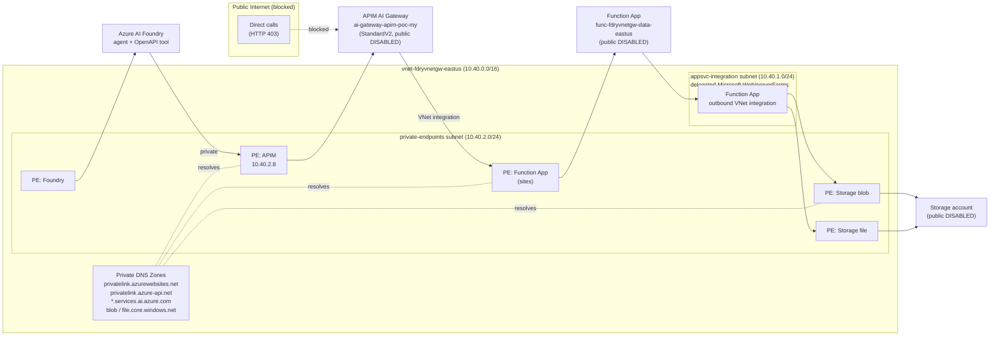
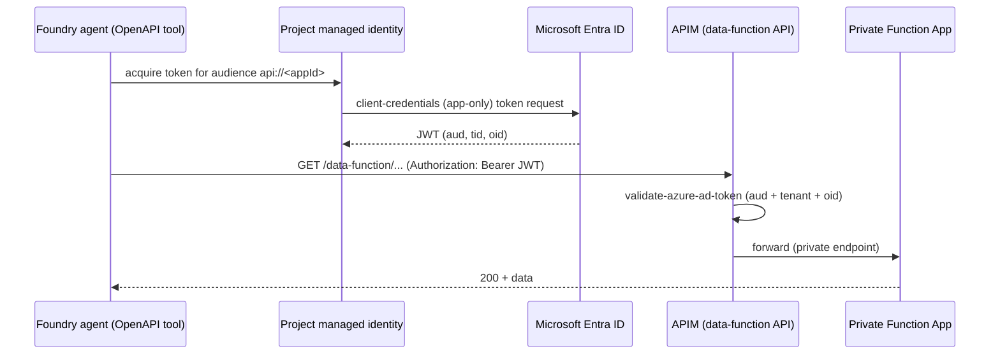
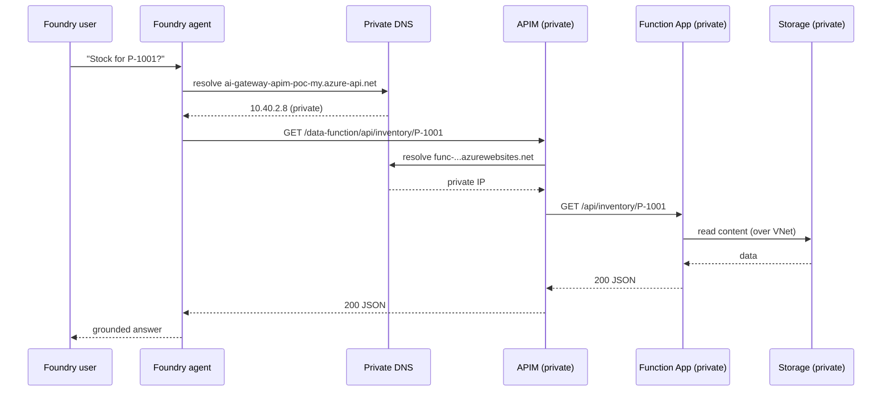

# Private Data Function App as a Foundry Agent Tool

This guide shows how to provision a **private Azure Function App** that serves data APIs,
expose it through the **private Azure API Management (APIM) AI gateway**, and consume it as an
**OpenAPI tool** in an **Azure AI Foundry agent** — with **private endpoints for every hop** and
**public network access disabled** end to end.

Everything is **config-driven**. No resource names, URLs, subnets, or paths are hardcoded in the
scripts or function code; they all come from [`config/function_app_config.json`](../config/function_app_config.json)
and [`config/azure_resources.json`](../config/azure_resources.json).

---

## Table of Contents

- [Architecture](#architecture)
- [Key URLs](#key-urls)
- [Why Each Resource Is Private](#why-each-resource-is-private)
- [Developer Access: Keep It Private, but Let the Company IP Range Test](#developer-access-keep-it-private-but-let-the-company-ip-range-test)
- [Managed-Identity Auth for the Foundry Agent (Recommended)](#managed-identity-auth-for-the-foundry-agent-recommended)
- [Prerequisites](#prerequisites)
- [Configuration (No Hardcoding)](#configuration-no-hardcoding)
- [The Function App](#the-function-app)
- [API Endpoints](#api-endpoints)
- [Swagger / OpenAPI](#swagger--openapi)
- [Step-by-Step: Configure a Private Function App as a Foundry Agent Tool](#step-by-step-configure-a-private-function-app-as-a-foundry-agent-tool)
  - [Step 1 — Provision the private Function App](#step-1--provision-the-private-function-app)
  - [Step 2 — Verify private networking](#step-2--verify-private-networking)
  - [Step 3 — Import the API into the private APIM gateway](#step-3--import-the-api-into-the-private-apim-gateway)
  - [Step 4 — Enable APIM → Function backend reachability](#step-4--enable-apim--function-backend-reachability)
  - [Step 5 — Wire the API as a Foundry agent tool](#step-5--wire-the-api-as-a-foundry-agent-tool)
  - [Step 6 — Test the agent](#step-6--test-the-agent)
- [Network Flow Summary](#network-flow-summary)
- [Configuration Reference](#configuration-reference)
- [Troubleshooting](#troubleshooting)
- [Microsoft Learn References](#microsoft-learn-references)

---

## Architecture



**Request path:** Foundry agent → (private DNS) → **APIM private endpoint** → APIM policy →
(APIM outbound VNet integration) → **Function App private endpoint** → Function runtime →
(VNet integration) → **private Storage**. No hop traverses the public internet.

---

## Key URLs

| Resource | URL | Reachable from |
|----------|-----|----------------|
| Azure Function host | `https://func-fdryvnetgw-data-eastus.azurewebsites.net` | Inside the VNet only |
| Function Swagger UI | `https://func-fdryvnetgw-data-eastus.azurewebsites.net/api/swagger` | Inside the VNet only |
| Function OpenAPI doc | `https://func-fdryvnetgw-data-eastus.azurewebsites.net/api/openapi.json` | Inside the VNet only |
| APIM endpoint for the Function API | `https://ai-gateway-apim-poc-my.azure-api.net/data-function/api` | Inside the VNet only |
| APIM OpenAPI for the Function API | `https://ai-gateway-apim-poc-my.azure-api.net/data-function/api/openapi.json` | Inside the VNet only |
| Foundry project endpoint | `https://002-ai-poc-private.services.ai.azure.com/api/projects/proj-default` | Inside the VNet only |
| Foundry agent portal | `https://ai.azure.com` | Browser (data-plane stays private) |

> All values above are derived from the config files. If you change a resource name in
> [`config/function_app_config.json`](../config/function_app_config.json), the scripts and these URLs change with it.

---

## Why Each Resource Is Private

| Hop | Mechanism | Public access |
|-----|-----------|---------------|
| Foundry → APIM | APIM private endpoint (`privatelink.azure-api.net` → 10.40.2.8) | APIM `publicNetworkAccess=Disabled` |
| APIM → Function | APIM outbound VNet integration + Function private endpoint (`privatelink.azurewebsites.net`) | Function `publicNetworkAccess=Disabled` |
| Function → Storage | Function VNet integration + Storage blob/file private endpoints | Storage `publicNetworkAccess=Disabled` |
| Name resolution | Private DNS zones linked to `vnet-fdryvnetgw-eastus` | Split-horizon: public DNS never returns private IPs |

---

## Developer Access: Keep It Private, but Let the Company IP Range Test

The end-to-end design above keeps **Foundry, the Function App, and APIM** private with `publicNetworkAccess=Disabled`. That is correct for production traffic, but it also blocks the people who need to **test** the system from their laptops:

- the **APIM developer/test portal** and direct gateway calls (`https://ai-gateway-apim-poc-my.azure-api.net/...`),
- the **Foundry portal** data-plane (`https://002-ai-poc-private.services.ai.azure.com/...` behind `https://ai.azure.com`),
- the **Function Swagger UI** for spec validation.

There are two supported ways to give developers access. **Pattern A is the most secure; use Pattern B only when A is not available.**

### Pattern A — Private access from inside the network (recommended)

Keep all three resources fully private and bring the developer *into* the VNet:

| Option | What it is | When to use |
|--------|-----------|-------------|
| **VNet jump box** | A small VM in a `dev-jumpbox` subnet of `vnet-fdryvnetgw-eastus`, reached via Azure Bastion | Quick, no client setup, fully private |
| **Point-to-Site / Site-to-Site VPN** | VPN Gateway in the VNet; laptops dial in and resolve private DNS | Many developers, ongoing access |
| **Private DNS resolver + ExpressRoute** | Corporate network peered/forwarded to the VNet | Enterprise, on-prem integration |

With Pattern A nothing is ever public: `publicNetworkAccess` stays `Disabled`, and the private DNS zones (`privatelink.azure-api.net`, `privatelink.azurewebsites.net`, `*.services.ai.azure.com`) resolve to the private endpoint IPs from inside the VNet.

```powershell
# Example: a Bastion-reachable jump box subnet (one-time)
az network vnet subnet create -g ai-myaacoub --vnet-name vnet-fdryvnetgw-eastus `
  --name dev-jumpbox --address-prefixes 10.40.3.0/24
# Then create a small VM in dev-jumpbox and connect via Azure Bastion (no public IP on the VM).
```

### Pattern B — Public + company-IP allowlist (when a VNet path is not available)

If developers cannot join the VNet, you can flip each resource to `publicNetworkAccess=Enabled` **but restrict inbound traffic to the company/developer IP range only**. Every other source is denied, so the surface stays tight.

> ⚠️ **Security trade-off:** an IP allowlist is weaker than a private path. Anything egressing through an allowed IP can reach the resource. Prefer a narrow, well-known corporate CIDR (e.g. an ExpressRoute/NAT egress block) over scattered `/32`s, and revert to Pattern A when possible.

#### Step 1 — Identify the company egress IP range

Use the **corporate NAT/proxy egress CIDR** your network team owns (for example `203.0.113.0/24`). This is the public IP block all developer traffic appears to come from.

> **Gotcha — Azure SNAT pools:** if developers reach Azure PaaS endpoints from inside Azure (Cloud Shell, a hosted runner, a dev box, or certain corporate proxies), their traffic does **not** use the office internet IP. It egresses through a **rotating pool of Azure SNAT IPs**. A single `/32` will intermittently fail. Discover the actual source IPs from the `x-ms-forbidden-ip` response header that App Service returns on a 403:
>
> ```powershell
> # Sample the egress IP that App Service sees (works even while public access is restricted)
> $ips=@{}
> 1..60 | ForEach-Object {
>   $h = curl.exe -sS -D - -o NUL "https://func-fdryvnetgw-data-eastus.azurewebsites.net/api/health" 2>$null |
>        Select-String 'x-ms-forbidden-ip'
>   if ($h) { $ip = ($h -split ':')[1].Trim(); $ips[$ip] = $ips[$ip] + 1 }
> }
> $ips.GetEnumerator() | Sort-Object Name    # the full set of IPs to allowlist
> ```

#### Step 2 — Allowlist the range on APIM (gateway ip-filter)

Flip APIM to public, then add an `ip-filter` to the **global policy**. The global scope must **not** contain `<base/>`.

```powershell
# Enable public access (async, ~4 min on StandardV2)
az rest --method PATCH `
  --url "https://management.azure.com/subscriptions/<sub>/resourceGroups/ai-myaacoub/providers/Microsoft.ApiManagement/service/ai-gateway-apim-poc-my?api-version=2024-05-01" `
  --body '{"properties":{"publicNetworkAccess":"Enabled"}}' --headers "Content-Type=application/json"
```

Global policy (`<policies>/policy`) — allow only the company range:

```xml
<policies>
  <inbound>
    <ip-filter action="allow">
      <address-range from="203.0.113.0" to="203.0.113.255" />
      <!-- or individual <address>X.X.X.X</address> entries -->
    </ip-filter>
  </inbound>
  <backend><forward-request /></backend>
  <outbound />
  <on-error />
</policies>
```

A request that passes the filter returns the API/`404` (not `403`). With the developer portal enabled, testers can now exercise the gateway and the **API test console**.

#### Step 3 — Allowlist the range on the Function App (access restrictions)

```powershell
az functionapp update -g ai-myaacoub -n func-fdryvnetgw-data-eastus --set publicNetworkAccess=Enabled
az functionapp config access-restriction add -g ai-myaacoub -n func-fdryvnetgw-data-eastus `
  --rule-name allow-company --action Allow --ip-address 203.0.113.0/24 --priority 100
# An implicit "Deny all" is appended automatically once any Allow rule exists.
```

> **APIM → Function egress gotcha:** when APIM (public, vnetType=None) forwards to the Function over its outbound NAT, the Function sees **APIM's egress IP**, not the developer's. If that IP is not allowlisted, the gateway call returns the App Service page `403 Web App - Unavailable` with header `x-ms-forbidden-ip: <apim-egress-ip>`. **Also allowlist APIM's outbound IP on the Function:**
>
> ```powershell
> # Discover APIM's egress IP (it appears in x-ms-forbidden-ip when calling THROUGH the gateway)
> curl.exe -sS -D - -o NUL "https://ai-gateway-apim-poc-my.azure-api.net/data-function/api/categories" |
>   Select-String 'x-ms-forbidden-ip'
> az functionapp config access-restriction add -g ai-myaacoub -n func-fdryvnetgw-data-eastus `
>   --rule-name allow-apim-egress --action Allow --ip-address 4.156.128.70/32 --priority 140
> ```
> The cleaner alternative is to give APIM **outbound VNet integration** (Step 4 of the main walkthrough) so it reaches the Function over the private endpoint and no egress `/32` is needed.

#### Step 4 — Allowlist the range on Foundry (network ACLs)

This is what lets developers open the **Foundry portal** (`https://ai.azure.com`) and have its data-plane calls to `002-ai-poc-private.services.ai.azure.com` succeed.

```powershell
az cognitiveservices account network-rule add -g ai-myaacoub -n 002-ai-poc-private --ip-address 203.0.113.0/24
# Ensure default action denies everything else:
az resource update --ids "<foundry-account-id>" --api-version 2024-10-01 `
  --set properties.publicNetworkAccess=Enabled properties.networkAcls.defaultAction=Deny
```

#### Step 5 — Keep the three allowlists in sync

Because the same developer pool must be allowed on **all three** resources, drift causes confusing, intermittent `403`s (one resource updated, another not). Use [`scripts/sync-ip-allowlists.ps1`](../scripts/sync-ip-allowlists.ps1) to set the identical client-IP set on APIM, the Function App, and Foundry in one shot (and to keep APIM's egress IP on the Function):

```powershell
# Default set is the discovered company/dev egress IPs; override with -ClientIp as needed
./scripts/sync-ip-allowlists.ps1 -ClientIp '203.0.113.10','203.0.113.11' -ApimEgressIp '4.156.128.70'
```

#### Step 6 — Verify

```powershell
# Gateway should be consistently 200 from an allowed IP
1..20 | ForEach-Object { curl.exe -sS -o NUL -w "%{http_code} " `
  "https://ai-gateway-apim-poc-my.azure-api.net/data-function/api/categories" }
```

Then open `https://ai.azure.com` → project `proj-default` and confirm the portal loads agents/models without an access error.

### Best practices checklist

- **Prefer Pattern A** (jump box / VPN / private resolver). Treat Pattern B as a temporary testing convenience, not a production posture.
- **Allowlist a CIDR, not a pile of `/32`s.** A stable corporate egress block (or ExpressRoute NAT range) avoids the SNAT-rotation whack-a-mole.
- **Allow APIM's outbound egress IP on the Function**, or — better — give APIM outbound VNet integration so the backend hop stays private.
- **Never use `defaultAction=Allow`.** Always default-Deny and allow explicitly.
- **Synchronize all three resources together** with [`scripts/sync-ip-allowlists.ps1`](../scripts/sync-ip-allowlists.ps1); a partial update is the most common cause of intermittent `403`.
- **Re-discover egress IPs after network changes** via the `x-ms-forbidden-ip` header; corporate NAT/SNAT pools change over time.
- **Document and time-box** any public window. Revert to `publicNetworkAccess=Disabled` once testing is done (the root [`scripts/rollback-private-cutover.ps1`](../scripts/rollback-private-cutover.ps1) re-enables/locks down).
- **Distinguish the two 403s:** APIM ip-filter returns JSON `{ "statusCode": 403, "message": "Forbidden" }`; App Service IP block returns the HTML `403 Web App - Unavailable` page with `x-ms-forbidden-ip`. The header tells you exactly which IP to add and on which layer.

---

## Managed-Identity Auth for the Foundry Agent (Recommended)

IP allowlisting cannot reliably cover the **Foundry agent's** call to APIM. When the agent
invokes its OpenAPI tool, the request egresses from a **Microsoft-managed IP that is not in
any customer allowlist** and rotates per destination — the same root cause that breaks the
Foundry portal probe. Chasing those IPs with `ip-filter` is whack-a-mole and will silently
fail again later. The durable, least-privilege fix is **Microsoft Entra ID token auth**: the
agent presents a token from its **managed identity**, and APIM validates it.

### How it works



1. An **Entra app registration** (`foundry-data-function-api`, App ID URI
   `api://74b186a6-1fab-4856-a13f-28935a0a2393`) is created **only to name the token
   audience** — APIM has no native Entra resource ID of its own. It needs a service
   principal so Entra will mint tokens for it, but no secret, no API permissions, and no
   redirect URI.
2. The Foundry **project's system-assigned managed identity** requests an app-only token
   for that audience. App-only token issuance does **not** require an app-role assignment,
   so this works out of the box.
3. The APIM **data-function** API policy runs `validate-azure-ad-token` and checks three
   things: `aud` (the audience above), `tid` (tenant `b158173c-…`), and `oid` (the Foundry
   account or project managed-identity object id). Anything else is rejected with `401`.
4. The agent's OpenAPI tool is wired with managed-identity auth in
   [`scripts/create_function_agent.py`](../scripts/create_function_agent.py) via
   `OpenApiManagedAuthDetails` / `OpenApiManagedSecurityScheme(audience=…)`.

All of these identifiers are stored in
[`config/function_app_config.json`](../config/function_app_config.json) → `apim.entra_auth`
(no hardcoding in scripts).

### APIM policy changes applied

The ip-filter used for IP allowlisting was **moved from the global scope to per-API scope**
so that removing it from the agent's path does not expose the other APIs:

| API | Inbound policy after the change |
|-----|---------------------------------|
| `foundry-data-function-api` | `choose`: **token branch** (`validate-azure-ad-token`) when an `Authorization` header is present, **else** an `ip-filter` fallback for developer hosts |
| `002-ai-poc-private`, `foundry-agents-gateway`, `foundry-privatevnet-agent-gateway`, `foundry-privatevnet-app-api` | their original policy **plus** an API-scope `ip-filter` (re-applied from config) |
| *global (service scope)* | ip-filter **removed** (empty default policy, no `<base/>`) |

This is fully reproducible from config:

```powershell
# 1) data-function API: import + Entra-token-or-IP-fallback policy
pwsh ./scripts/configure-function-apim.ps1
# 2) move ip-filter off the global scope onto the other APIs (idempotent)
pwsh ./scripts/configure-apim-mi-auth.ps1
# 3) (re)wire the agent tool to use managed identity
python ./scripts/create_function_agent.py
```

The token-or-IP `choose` keeps **developer access working** (a browser/curl from an
allowlisted dev IP sends no `Authorization` header → hits the `ip-filter` fallback), while
the **agent** (which always sends a bearer token) is validated by Entra ID. A misconfigured
token therefore only affects the agent, never the dev path or the other APIs.

### Is this "RBAC"? — App role assignment (optional hardening)

Validating the managed identity's `oid` is already an explicit authorization decision
(only those two identities are accepted). For a stricter, Azure-RBAC-style posture you can
expose an **app role** on the audience app registration and **assign it to the Foundry
managed identity**, then have APIM additionally require that role claim:

```powershell
# Expose an app role "Data.Invoke" on the app registration, then assign it to the
# Foundry project managed identity (objectId e69e2149-… ; appId of the audience app
# 74b186a6-…). Requires Application.ReadWrite.All / AppRoleAssignment.ReadWrite.All.
$appObjId  = (az ad app show --id 74b186a6-1fab-4856-a13f-28935a0a2393 --query id -o tsv)
$spObjId   = '4fdae9c1-2463-4e5b-ac6e-b4e292e42d31'   # audience app's service principal
$miObjId   = 'e69e2149-7405-4a95-8f56-d40d926ce4f9'   # Foundry project managed identity
# (define the appRole in the manifest, then:)
az rest --method POST `
  --url "https://graph.microsoft.com/v1.0/servicePrincipals/$miObjId/appRoleAssignments" `
  --body "{`"principalId`":`"$miObjId`",`"resourceId`":`"$spObjId`",`"appRoleId`":`"<roleId>`"}"
```

Then add a `<required-claims>` check for `roles` to the `validate-azure-ad-token` policy.
This is optional — the `oid` claim check already restricts the API to the two known
identities — but app-role assignment is the gold-standard, auditable RBAC grant.

> **Security note:** while testing, the Foundry account is set to
> `publicNetworkAccess=Enabled` + `networkAcls.defaultAction=Allow`. For production, revert
> to a private endpoint (Pattern A) — token auth and private networking are complementary,
> not alternatives.

---

## Prerequisites


- The private VNet, APIM (StandardV2, private), and Foundry (private) from the root
  [README](../README.md) are already deployed.
- Azure CLI logged in to subscription `86b37969-9445-49cf-b03f-d8866235171c`.
- Python 3.11 and (optionally) [Azure Functions Core Tools v4](https://learn.microsoft.com/azure/azure-functions/functions-run-local) for local testing.
- `privatelink.azurewebsites.net` private DNS zone linked to the VNet (already present in this environment).
- The `appsvc-integration` subnet delegated to `Microsoft.Web/serverFarms` (already present).

---

## Configuration (No Hardcoding)

All settings live in [`config/function_app_config.json`](../config/function_app_config.json):

| Section | Purpose |
|---------|---------|
| `function_app` | App name, runtime, routes, public access |
| `hosting_plan` | Plan name/SKU; `reuse_existing` + `reuse_plan_name` to reuse an **East US** plan |
| `storage_account` | Name, SKU, `private_storage`, content-over-VNet, blob/file DNS zones |
| `networking` | VNet, integration subnet, private-endpoint subnet, DNS zone, PE name |
| `apim` | API id, path, display name, product, subscription requirement |
| `foundry_agent` | Agent name, model, tool name, instructions |
| `endpoints` | Deterministic URLs echoed by the scripts |

> **Plan reuse note:** every pre-existing App Service plan in this subscription is in **West US 2**.
> Regional VNet integration requires the plan to be in **East US** (same region as the VNet), so the
> deployment creates a new `B1` Linux plan in East US by default. To reuse an East US plan, set
> `hosting_plan.reuse_existing = true` and `hosting_plan.reuse_plan_name`.

---

## The Function App

- **Model:** Azure Functions **Python v2** programming model ([`function-app/function_app.py`](function_app.py)).
- **Hosting:** Linux, Functions runtime v4, dedicated App Service plan (supports private endpoints).
- **Data:** read-only sample catalog in [`function-app/data/catalog.json`](data/catalog.json) (products, categories, inventory, orders).
- **Auth:** anonymous at the function layer — access is enforced by the **private network boundary** and **APIM**.

```
function-app/
├── function_app.py     # v2 model: all HTTP routes
├── host.json           # routePrefix "api", extension bundle v4
├── requirements.txt    # azure-functions
├── openapi.json        # single source of truth for Swagger + APIM + Foundry
├── data/catalog.json   # sample data
└── .funcignore
```

---

## API Endpoints

| Method | Route | Description |
|--------|-------|-------------|
| GET | `/api/health` | Liveness/readiness probe |
| GET | `/api/products?category={id}` | List products (optional category filter) |
| GET | `/api/products/{productId}` | Get a product by id |
| GET | `/api/categories` | List categories with product counts |
| GET | `/api/inventory/{productId}` | Stock levels per warehouse |
| GET | `/api/orders?status={status}` | List orders (optional status filter) |
| GET | `/api/openapi.json` | OpenAPI 3.0 document (server URL resolved to caller host) |
| GET | `/api/swagger` | Swagger UI |

---

## Swagger / OpenAPI

A single OpenAPI 3.0 document, [`function-app/openapi.json`](openapi.json), is the source of truth used by:

1. The Function App's `/api/openapi.json` endpoint (server URL rewritten to the request host).
2. The `/api/swagger` Swagger UI.
3. APIM import ([`scripts/configure-function-apim.ps1`](../scripts/configure-function-apim.ps1)).
4. The Foundry agent OpenAPI tool ([`scripts/create_function_agent.py`](../scripts/create_function_agent.py), server URL set to the APIM gateway path).

---

## Step-by-Step: Configure a Private Function App as a Foundry Agent Tool

### Step 1 — Provision the private Function App

```powershell
./scripts/deploy-function-app.ps1
```

This runs seven idempotent stages: storage → East US plan → Function App → VNet integration →
code deploy (while SCM is still reachable) → private endpoints (storage blob/file + Function `sites`)
→ **disable public network access** on storage and the Function App.

Options: `-SkipDeploy` (infra only) · `-KeepPublicAccess` (skip the final lockdown for debugging).

### Step 2 — Verify private networking

```powershell
# Function App public access should be Disabled
az functionapp show -g ai-myaacoub -n func-fdryvnetgw-data-eastus --query publicNetworkAccess -o tsv

# Private endpoint should have an A record in the zone
az network private-dns record-set a list -g ai-myaacoub -z privatelink.azurewebsites.net -o table
```

A direct public call to the function host should now fail (timeout / 403); it is only reachable inside the VNet.

### Step 3 — Import the API into the private APIM gateway

```powershell
./scripts/configure-function-apim.ps1
```

Imports `function-app/openapi.json` into APIM under `/data-function`, sets the backend to the
Function App's private hostname, disables the subscription-key requirement, applies a backend/CORS
policy, and adds the API to the product.

### Step 4 — Enable APIM → Function backend reachability

For APIM to call the **private** Function backend, the APIM instance needs **outbound VNet integration**
(StandardV2) into a subnet that can resolve `privatelink.azurewebsites.net`. Verify:

```powershell
az apim show -g ai-myaacoub -n ai-gateway-apim-poc-my --query "virtualNetworkConfiguration" -o json
```

If APIM has no outbound VNet integration yet, configure it on the `appsvc-integration` (or a dedicated
APIM) subnet so the gateway can resolve and reach the Function private endpoint. See
[Integrate APIM (v2) with a VNet for outbound](https://learn.microsoft.com/azure/api-management/integrate-vnet-outbound).

### Step 5 — Wire the API as a Foundry agent tool

```powershell
python ./scripts/create_function_agent.py
```

Creates/updates the `Data-Function-Agent` Foundry agent with an **OpenAPI tool** whose server URL is the
**APIM gateway path** `https://ai-gateway-apim-poc-my.azure-api.net/data-function`. The Foundry project
reaches APIM over its private endpoint, so the tool call never leaves the VNet.

### Step 6 — Test the agent

Open [https://ai.azure.com](https://ai.azure.com), select project `proj-default`, open `Data-Function-Agent`,
and ask:

- *"List all products in the audio category."*
- *"How much stock is available for P-1001?"*
- *"Show me all shipped orders."*

The agent invokes the `data_function_api` tool → APIM → private Function App → returns grounded data.

---

## Network Flow Summary



---

## Configuration Reference

| File | Role |
|------|------|
| [`config/function_app_config.json`](../config/function_app_config.json) | Single source of truth for this feature |
| [`scripts/deploy-function-app.ps1`](../scripts/deploy-function-app.ps1) | Provision + private endpoints + lockdown |
| [`scripts/configure-function-apim.ps1`](../scripts/configure-function-apim.ps1) | Import API into private APIM |
| [`scripts/create_function_agent.py`](../scripts/create_function_agent.py) | Create Foundry agent OpenAPI tool |
| [`function-app/function_app.py`](function_app.py) | Function code (Python v2) |
| [`function-app/openapi.json`](openapi.json) | OpenAPI 3.0 spec |

---

## Troubleshooting

| Symptom | Likely cause | Fix |
|---------|--------------|-----|
| `deploy` succeeds but function returns 500 on cold start | Private storage locked down before content share ready | Re-run deploy with `-KeepPublicAccess`, confirm app starts, then lock down |
| APIM returns 500 `BackendConnectionFailure` | APIM has no outbound VNet integration to the Function PE | Configure APIM outbound VNet integration (Step 4) |
| Agent tool call times out | Foundry cannot resolve/reach APIM privately | Confirm `privatelink.azure-api.net` A record + APIM private endpoint |
| `func host` reachable from internet | Lockdown stage skipped | Re-run deploy without `-KeepPublicAccess` |
| Zip deploy fails after lockdown | SCM site is private | Deploy before disabling public access (default stage order) |
| Gateway returns HTML `403 Web App - Unavailable` (`x-ms-forbidden-ip` set) | Function blocks APIM's outbound egress IP | Allowlist APIM's egress IP on the Function, or use APIM outbound VNet integration (see [Developer Access](#developer-access-keep-it-private-but-let-the-company-ip-range-test)) |
| Gateway returns JSON `{ "statusCode": 403, "message": "Forbidden" }` | Caller IP not in APIM `ip-filter` | Add the company/egress IP to the APIM global policy; run [`scripts/sync-ip-allowlists.ps1`](../scripts/sync-ip-allowlists.ps1) |
| Foundry portal shows an access/network error | Caller IP not in Foundry network ACLs | Add the company IP range to Foundry network rules (Step 4) |
| Intermittent `403` (some calls 200, some 403) | Allowlists out of sync, or rotating SNAT egress IP | Sync all three resources; discover missing IPs via `x-ms-forbidden-ip` |
| **Foundry agent** tool call returns `403` while dev curl works | Agent egresses from a Microsoft-managed IP not in any `ip-filter` | Switch the agent to managed-identity token auth (see [Managed-Identity Auth](#managed-identity-auth-for-the-foundry-agent-recommended)); IP allowlisting cannot cover the agent |
| Agent tool call returns `401 Invalid or missing Entra ID token` | Token `aud`/`tenant`/`oid` did not match the APIM policy | Confirm `apim.entra_auth.audience`, `tenant_id`, and the managed-identity `oid`s in config match the deployed app registration; re-run `configure-function-apim.ps1` |

---

## Microsoft Learn References

- [Azure Functions networking options](https://learn.microsoft.com/azure/azure-functions/functions-networking-options)
- [Establish Azure Functions private site access](https://learn.microsoft.com/azure/azure-functions/functions-create-vnet)
- [Use private endpoints for Azure Functions / App Service](https://learn.microsoft.com/azure/app-service/networking/private-endpoint)
- [Integrate your app with an Azure virtual network (regional VNet integration)](https://learn.microsoft.com/azure/app-service/overview-vnet-integration)
- [Restrict storage to a virtual network for Azure Functions](https://learn.microsoft.com/azure/azure-functions/configure-networking-how-to#restrict-your-storage-account-to-a-virtual-network)
- [Azure Functions Python developer guide (v2 model)](https://learn.microsoft.com/azure/azure-functions/functions-reference-python)
- [Import an API into API Management](https://learn.microsoft.com/azure/api-management/import-and-publish)
- [Integrate API Management (v2 tiers) with a virtual network for outbound](https://learn.microsoft.com/azure/api-management/integrate-vnet-outbound)
- [Use API Management with private endpoints](https://learn.microsoft.com/azure/api-management/private-endpoint)
- [How to use Azure AI Foundry Agent Service with OpenAPI Specified Tools](https://learn.microsoft.com/azure/ai-foundry/agents/how-to/tools/openapi-spec)
- [Azure AI Foundry Agent Service network-secured (private) setup](https://learn.microsoft.com/azure/ai-foundry/agents/how-to/virtual-networks)
- [APIM `validate-azure-ad-token` policy](https://learn.microsoft.com/azure/api-management/validate-azure-ad-token-policy)
- [Authenticate to an OpenAPI tool with managed identity in Foundry Agent Service](https://learn.microsoft.com/azure/ai-foundry/agents/how-to/tools/openapi-spec#authenticating-with-managed-identity)
- [Azure Private Link / private endpoint overview](https://learn.microsoft.com/azure/private-link/private-endpoint-overview)
- [Azure Private DNS zones for private endpoints](https://learn.microsoft.com/azure/private-link/private-endpoint-dns)
