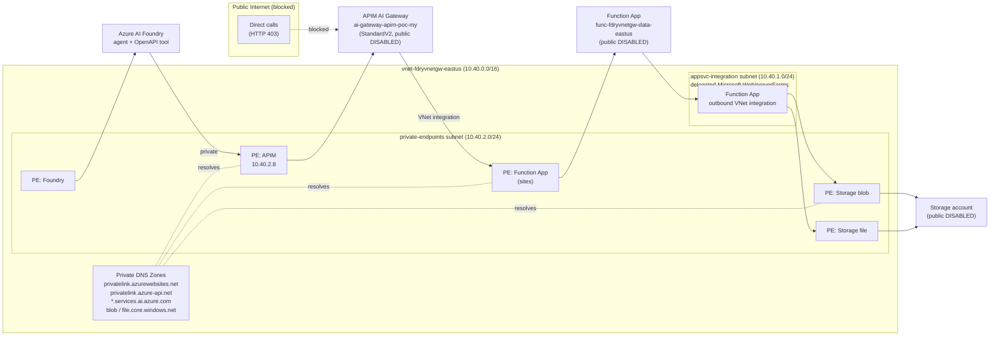
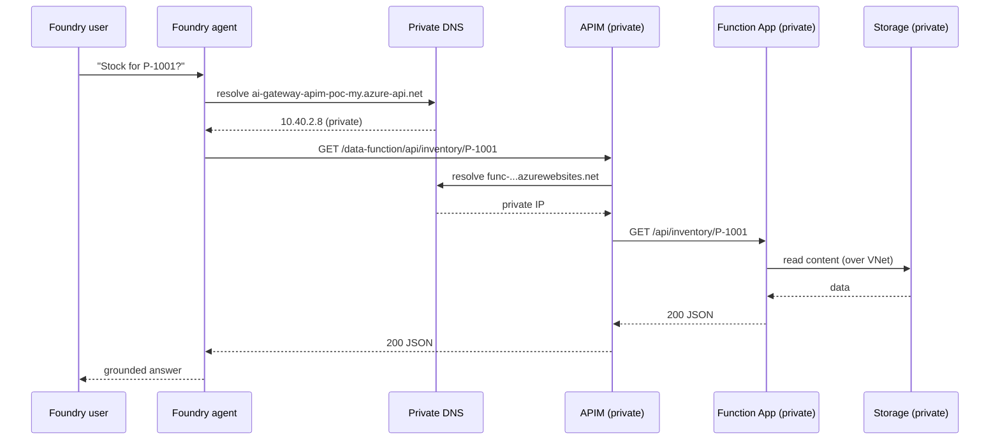

# Private Data Function App as a Foundry Agent Tool

This guide shows how to provision a **private Azure Function App** that serves data APIs,
expose it through the **private Azure API Management (APIM) AI gateway**, and consume it as an
**OpenAPI tool** in an **Azure AI Foundry agent** — with **private endpoints for every hop** and
**public network access disabled** end to end.

Everything is **config-driven**. No resource names, URLs, subnets, or paths are hardcoded in the
scripts or function code; they all come from [`config/function_app_config.json`](../config/function_app_config.json)
and [`config/azure_resources.json`](../config/azure_resources.json).

---

## Table of Contents

- [Architecture](#architecture)
- [Key URLs](#key-urls)
- [Why Each Resource Is Private](#why-each-resource-is-private)
- [Prerequisites](#prerequisites)
- [Configuration (No Hardcoding)](#configuration-no-hardcoding)
- [The Function App](#the-function-app)
- [API Endpoints](#api-endpoints)
- [Swagger / OpenAPI](#swagger--openapi)
- [Step-by-Step: Configure a Private Function App as a Foundry Agent Tool](#step-by-step-configure-a-private-function-app-as-a-foundry-agent-tool)
  - [Step 1 — Provision the private Function App](#step-1--provision-the-private-function-app)
  - [Step 2 — Verify private networking](#step-2--verify-private-networking)
  - [Step 3 — Import the API into the private APIM gateway](#step-3--import-the-api-into-the-private-apim-gateway)
  - [Step 4 — Enable APIM → Function backend reachability](#step-4--enable-apim--function-backend-reachability)
  - [Step 5 — Wire the API as a Foundry agent tool](#step-5--wire-the-api-as-a-foundry-agent-tool)
  - [Step 6 — Test the agent](#step-6--test-the-agent)
- [Network Flow Summary](#network-flow-summary)
- [Configuration Reference](#configuration-reference)
- [Troubleshooting](#troubleshooting)
- [Microsoft Learn References](#microsoft-learn-references)

---

## Architecture



**Request path:** Foundry agent → (private DNS) → **APIM private endpoint** → APIM policy →
(APIM outbound VNet integration) → **Function App private endpoint** → Function runtime →
(VNet integration) → **private Storage**. No hop traverses the public internet.

---

## Key URLs

| Resource | URL | Reachable from |
|----------|-----|----------------|
| Azure Function host | `https://func-fdryvnetgw-data-eastus.azurewebsites.net` | Inside the VNet only |
| Function Swagger UI | `https://func-fdryvnetgw-data-eastus.azurewebsites.net/api/swagger` | Inside the VNet only |
| Function OpenAPI doc | `https://func-fdryvnetgw-data-eastus.azurewebsites.net/api/openapi.json` | Inside the VNet only |
| APIM endpoint for the Function API | `https://ai-gateway-apim-poc-my.azure-api.net/data-function/api` | Inside the VNet only |
| APIM OpenAPI for the Function API | `https://ai-gateway-apim-poc-my.azure-api.net/data-function/api/openapi.json` | Inside the VNet only |
| Foundry project endpoint | `https://002-ai-poc-private.services.ai.azure.com/api/projects/proj-default` | Inside the VNet only |
| Foundry agent portal | `https://ai.azure.com` | Browser (data-plane stays private) |

> All values above are derived from the config files. If you change a resource name in
> [`config/function_app_config.json`](../config/function_app_config.json), the scripts and these URLs change with it.

---

## Why Each Resource Is Private

| Hop | Mechanism | Public access |
|-----|-----------|---------------|
| Foundry → APIM | APIM private endpoint (`privatelink.azure-api.net` → 10.40.2.8) | APIM `publicNetworkAccess=Disabled` |
| APIM → Function | APIM outbound VNet integration + Function private endpoint (`privatelink.azurewebsites.net`) | Function `publicNetworkAccess=Disabled` |
| Function → Storage | Function VNet integration + Storage blob/file private endpoints | Storage `publicNetworkAccess=Disabled` |
| Name resolution | Private DNS zones linked to `vnet-fdryvnetgw-eastus` | Split-horizon: public DNS never returns private IPs |

---

## Prerequisites

- The private VNet, APIM (StandardV2, private), and Foundry (private) from the root
  [README](../README.md) are already deployed.
- Azure CLI logged in to subscription `86b37969-9445-49cf-b03f-d8866235171c`.
- Python 3.11 and (optionally) [Azure Functions Core Tools v4](https://learn.microsoft.com/azure/azure-functions/functions-run-local) for local testing.
- `privatelink.azurewebsites.net` private DNS zone linked to the VNet (already present in this environment).
- The `appsvc-integration` subnet delegated to `Microsoft.Web/serverFarms` (already present).

---

## Configuration (No Hardcoding)

All settings live in [`config/function_app_config.json`](../config/function_app_config.json):

| Section | Purpose |
|---------|---------|
| `function_app` | App name, runtime, routes, public access |
| `hosting_plan` | Plan name/SKU; `reuse_existing` + `reuse_plan_name` to reuse an **East US** plan |
| `storage_account` | Name, SKU, `private_storage`, content-over-VNet, blob/file DNS zones |
| `networking` | VNet, integration subnet, private-endpoint subnet, DNS zone, PE name |
| `apim` | API id, path, display name, product, subscription requirement |
| `foundry_agent` | Agent name, model, tool name, instructions |
| `endpoints` | Deterministic URLs echoed by the scripts |

> **Plan reuse note:** every pre-existing App Service plan in this subscription is in **West US 2**.
> Regional VNet integration requires the plan to be in **East US** (same region as the VNet), so the
> deployment creates a new `B1` Linux plan in East US by default. To reuse an East US plan, set
> `hosting_plan.reuse_existing = true` and `hosting_plan.reuse_plan_name`.

---

## The Function App

- **Model:** Azure Functions **Python v2** programming model ([`function-app/function_app.py`](function_app.py)).
- **Hosting:** Linux, Functions runtime v4, dedicated App Service plan (supports private endpoints).
- **Data:** read-only sample catalog in [`function-app/data/catalog.json`](data/catalog.json) (products, categories, inventory, orders).
- **Auth:** anonymous at the function layer — access is enforced by the **private network boundary** and **APIM**.

```
function-app/
├── function_app.py     # v2 model: all HTTP routes
├── host.json           # routePrefix "api", extension bundle v4
├── requirements.txt    # azure-functions
├── openapi.json        # single source of truth for Swagger + APIM + Foundry
├── data/catalog.json   # sample data
└── .funcignore
```

---

## API Endpoints

| Method | Route | Description |
|--------|-------|-------------|
| GET | `/api/health` | Liveness/readiness probe |
| GET | `/api/products?category={id}` | List products (optional category filter) |
| GET | `/api/products/{productId}` | Get a product by id |
| GET | `/api/categories` | List categories with product counts |
| GET | `/api/inventory/{productId}` | Stock levels per warehouse |
| GET | `/api/orders?status={status}` | List orders (optional status filter) |
| GET | `/api/openapi.json` | OpenAPI 3.0 document (server URL resolved to caller host) |
| GET | `/api/swagger` | Swagger UI |

---

## Swagger / OpenAPI

A single OpenAPI 3.0 document, [`function-app/openapi.json`](openapi.json), is the source of truth used by:

1. The Function App's `/api/openapi.json` endpoint (server URL rewritten to the request host).
2. The `/api/swagger` Swagger UI.
3. APIM import ([`scripts/configure-function-apim.ps1`](../scripts/configure-function-apim.ps1)).
4. The Foundry agent OpenAPI tool ([`scripts/create_function_agent.py`](../scripts/create_function_agent.py), server URL set to the APIM gateway path).

---

## Step-by-Step: Configure a Private Function App as a Foundry Agent Tool

### Step 1 — Provision the private Function App

```powershell
./scripts/deploy-function-app.ps1
```

This runs seven idempotent stages: storage → East US plan → Function App → VNet integration →
code deploy (while SCM is still reachable) → private endpoints (storage blob/file + Function `sites`)
→ **disable public network access** on storage and the Function App.

Options: `-SkipDeploy` (infra only) · `-KeepPublicAccess` (skip the final lockdown for debugging).

### Step 2 — Verify private networking

```powershell
# Function App public access should be Disabled
az functionapp show -g ai-myaacoub -n func-fdryvnetgw-data-eastus --query publicNetworkAccess -o tsv

# Private endpoint should have an A record in the zone
az network private-dns record-set a list -g ai-myaacoub -z privatelink.azurewebsites.net -o table
```

A direct public call to the function host should now fail (timeout / 403); it is only reachable inside the VNet.

### Step 3 — Import the API into the private APIM gateway

```powershell
./scripts/configure-function-apim.ps1
```

Imports `function-app/openapi.json` into APIM under `/data-function`, sets the backend to the
Function App's private hostname, disables the subscription-key requirement, applies a backend/CORS
policy, and adds the API to the product.

### Step 4 — Enable APIM → Function backend reachability

For APIM to call the **private** Function backend, the APIM instance needs **outbound VNet integration**
(StandardV2) into a subnet that can resolve `privatelink.azurewebsites.net`. Verify:

```powershell
az apim show -g ai-myaacoub -n ai-gateway-apim-poc-my --query "virtualNetworkConfiguration" -o json
```

If APIM has no outbound VNet integration yet, configure it on the `appsvc-integration` (or a dedicated
APIM) subnet so the gateway can resolve and reach the Function private endpoint. See
[Integrate APIM (v2) with a VNet for outbound](https://learn.microsoft.com/azure/api-management/integrate-vnet-outbound).

### Step 5 — Wire the API as a Foundry agent tool

```powershell
python ./scripts/create_function_agent.py
```

Creates/updates the `Data-Function-Agent` Foundry agent with an **OpenAPI tool** whose server URL is the
**APIM gateway path** `https://ai-gateway-apim-poc-my.azure-api.net/data-function`. The Foundry project
reaches APIM over its private endpoint, so the tool call never leaves the VNet.

### Step 6 — Test the agent

Open [https://ai.azure.com](https://ai.azure.com), select project `proj-default`, open `Data-Function-Agent`,
and ask:

- *"List all products in the audio category."*
- *"How much stock is available for P-1001?"*
- *"Show me all shipped orders."*

The agent invokes the `data_function_api` tool → APIM → private Function App → returns grounded data.

---

## Network Flow Summary



---

## Configuration Reference

| File | Role |
|------|------|
| [`config/function_app_config.json`](../config/function_app_config.json) | Single source of truth for this feature |
| [`scripts/deploy-function-app.ps1`](../scripts/deploy-function-app.ps1) | Provision + private endpoints + lockdown |
| [`scripts/configure-function-apim.ps1`](../scripts/configure-function-apim.ps1) | Import API into private APIM |
| [`scripts/create_function_agent.py`](../scripts/create_function_agent.py) | Create Foundry agent OpenAPI tool |
| [`function-app/function_app.py`](function_app.py) | Function code (Python v2) |
| [`function-app/openapi.json`](openapi.json) | OpenAPI 3.0 spec |

---

## Troubleshooting

| Symptom | Likely cause | Fix |
|---------|--------------|-----|
| `deploy` succeeds but function returns 500 on cold start | Private storage locked down before content share ready | Re-run deploy with `-KeepPublicAccess`, confirm app starts, then lock down |
| APIM returns 500 `BackendConnectionFailure` | APIM has no outbound VNet integration to the Function PE | Configure APIM outbound VNet integration (Step 4) |
| Agent tool call times out | Foundry cannot resolve/reach APIM privately | Confirm `privatelink.azure-api.net` A record + APIM private endpoint |
| `func host` reachable from internet | Lockdown stage skipped | Re-run deploy without `-KeepPublicAccess` |
| Zip deploy fails after lockdown | SCM site is private | Deploy before disabling public access (default stage order) |

---

## Microsoft Learn References

- [Azure Functions networking options](https://learn.microsoft.com/azure/azure-functions/functions-networking-options)
- [Establish Azure Functions private site access](https://learn.microsoft.com/azure/azure-functions/functions-create-vnet)
- [Use private endpoints for Azure Functions / App Service](https://learn.microsoft.com/azure/app-service/networking/private-endpoint)
- [Integrate your app with an Azure virtual network (regional VNet integration)](https://learn.microsoft.com/azure/app-service/overview-vnet-integration)
- [Restrict storage to a virtual network for Azure Functions](https://learn.microsoft.com/azure/azure-functions/configure-networking-how-to#restrict-your-storage-account-to-a-virtual-network)
- [Azure Functions Python developer guide (v2 model)](https://learn.microsoft.com/azure/azure-functions/functions-reference-python)
- [Import an API into API Management](https://learn.microsoft.com/azure/api-management/import-and-publish)
- [Integrate API Management (v2 tiers) with a virtual network for outbound](https://learn.microsoft.com/azure/api-management/integrate-vnet-outbound)
- [Use API Management with private endpoints](https://learn.microsoft.com/azure/api-management/private-endpoint)
- [How to use Azure AI Foundry Agent Service with OpenAPI Specified Tools](https://learn.microsoft.com/azure/ai-foundry/agents/how-to/tools/openapi-spec)
- [Azure AI Foundry Agent Service network-secured (private) setup](https://learn.microsoft.com/azure/ai-foundry/agents/how-to/virtual-networks)
- [Azure Private Link / private endpoint overview](https://learn.microsoft.com/azure/private-link/private-endpoint-overview)
- [Azure Private DNS zones for private endpoints](https://learn.microsoft.com/azure/private-link/private-endpoint-dns)
